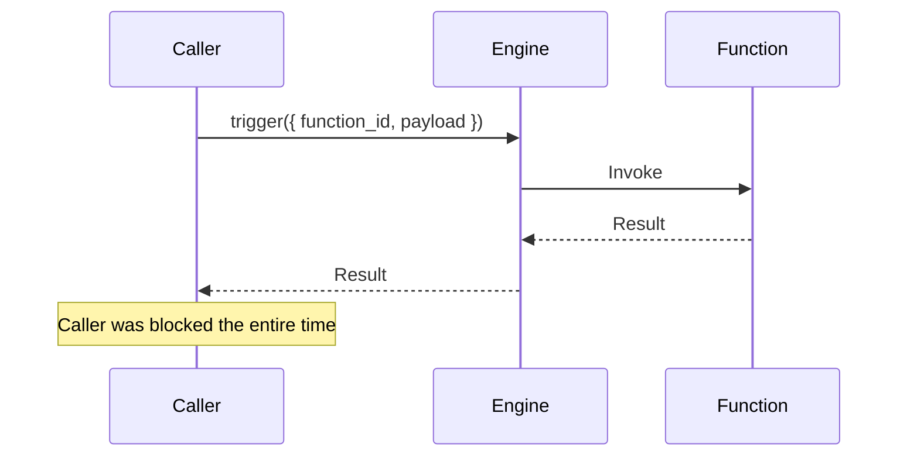
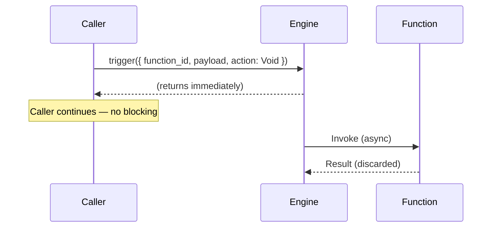
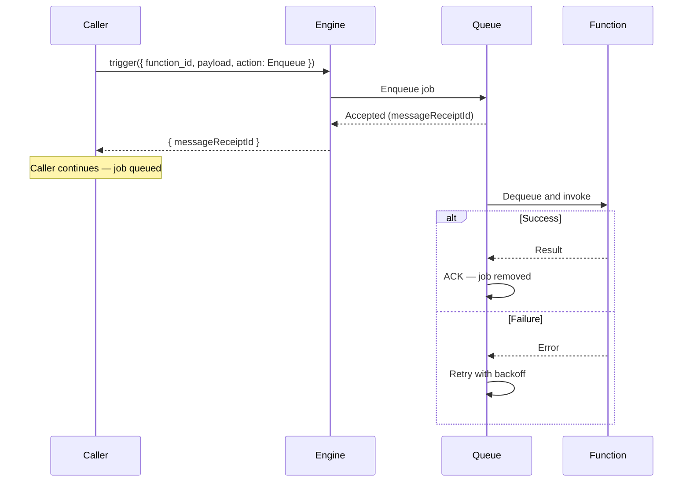
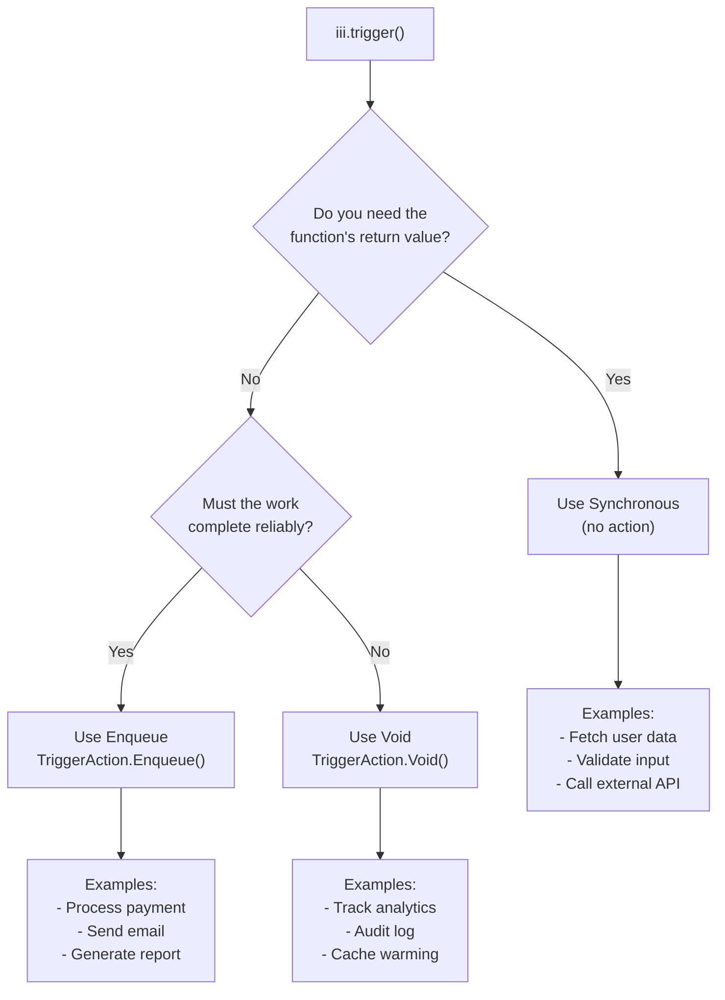

Every call to `trigger()` can behave in one of three fundamentally different ways depending on the **action** you pass. The choice affects latency, reliability, ordering, and error handling across your entire system.

## The Three Actions

| Action | Caller blocks? | Retries? | Returns |
|--------|---------------|----------|---------|
| _(none)_ — Synchronous | Yes | No | Function result |
| `Void` — Fire-and-forget | No | No | `None` / `null` |
| `Enqueue` — Named queue | No | Yes | `{ messageReceiptId }` |

### Synchronous (no action)

When you omit the `action` field, `trigger()` performs a **direct, synchronous invocation**. The caller sends the request to the engine, the engine routes it to the target function, and the caller blocks until the function returns a result or the timeout expires.

**When to use synchronous triggers:**

- You need the function's return value to continue (e.g. fetching data, validating input)
- The operation is fast and the caller can afford to wait
- You want errors to propagate directly to the caller
- Request/response APIs like HTTP endpoints that must return data to a client

### Void (fire-and-forget)

`TriggerAction.Void()` tells the engine to dispatch the invocation but **not wait for a result**. The caller continues immediately. If the target function fails, the caller is unaware — there are no retries and no acknowledgement.

**When to use Void:**

- The caller does not need a response
- Losing the occasional message is acceptable (best-effort delivery)
- You want minimal latency impact on the caller's hot path
- Side effects like logging, analytics, non-critical notifications

### Enqueue (named queue)

`TriggerAction.Enqueue({ queue: 'name' })` routes the invocation through a **named queue**. The caller receives an acknowledgement (`messageReceiptId`) once the engine accepts the job but does not wait for it to be processed. The queue provides retries, concurrency control, backoff, and optional FIFO ordering. If all retries are exhausted, the job moves to a dead letter queue.

**When to use Enqueue:**

- The work is expensive or slow and you do not want to block the caller
- You need automatic retries with backoff on failure
- You need concurrency control over how many jobs run in parallel
- You need FIFO ordering guarantees (e.g. financial transactions)
- You want failed jobs preserved in a dead letter queue for later inspection

## Key Differences

| Dimension | Synchronous | Void | Enqueue |
|-----------|------------|------|---------|
| **Caller blocks** | Yes — waits for result | No | No |
| **Returns** | Function return value | `null` / `None` | `{ messageReceiptId }` |
| **Error propagation** | Errors reach the caller directly | Errors are silent to the caller | Retried automatically; DLQ on exhaustion |
| **Retries** | None — caller handles retry logic | None | Configurable (`max_retries`, `backoff_ms`) |
| **Ordering** | Sequential by nature | No guarantees | Optional FIFO with `message_group_field` |
| **Concurrency control** | N/A | N/A | Configurable per queue |
| **Use case** | Read data, validate, RPC | Analytics, logs, non-critical side effects | Payments, emails, heavy processing |

## Decision Flowchart

Use this mental model when deciding which action to use:

## Related

<CardGroup cols={2}>
  <Card title="Use Trigger Actions" href="/how-to/trigger-actions" icon="code">
    Code examples and SDK syntax for each action type
  </Card>
  <Card title="Use Named Queues" href="/how-to/use-named-queues" icon="bolt">
    Configure named queues with retries, concurrency, and FIFO ordering
  </Card>
</CardGroup>
