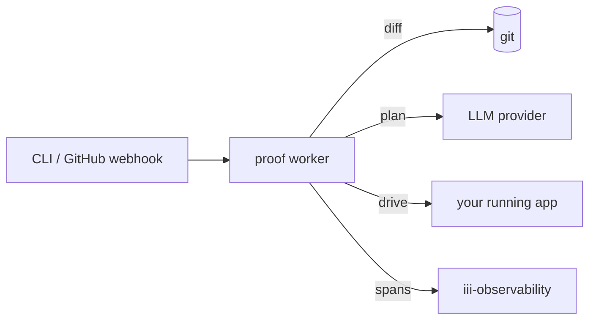

<Info title="Track 3 — iii for AI agents">
  This is tutorial **3 of 4** in Track 3. Estimated time: 20 minutes.
</Info>

## What you'll build

A continuous browser-test loop that:

1. Watches diffs in your repo.
2. Asks an LLM what user-visible behavior likely changed.
3. Generates a Playwright plan for those flows.
4. Runs the plan against a running version of your app.
5. Reports failures back through `iii-observability`.

You do this by adding one worker — `proof` — and pointing it at your
app.

## Prerequisites

- iii engine running.
- A web app you can run locally (e.g. the dashboard from
  [Tutorial 6](/tutorials/realtime-dashboard)).
- An LLM API key configured for `proof`.

## Steps

### 1. Add the proof worker

```bash
iii worker add proof
```

{/* TODO: confirm whether proof requires Playwright browsers to be installed separately, or installs on first run */}

### 2. Configure the target app

```yaml
{/* TODO: real proof config:
   target_url: http://localhost:3000
   diff_source: git
   llm: { provider: openai, model: ... }
*/}
```

### 3. Trigger a test run from a diff

```bash
iii trigger proof::run --data '{"base":"main","head":"HEAD"}'
```

{/* TODO: confirm proof's actual function id and trigger payload shape */}

`proof` will:

- Diff `main..HEAD`.
- Ask the LLM which user flows could be affected.
- Generate a Playwright plan.
- Execute it against `target_url`.
- Emit pass/fail spans visible in the console.

### 4. Wire it to PRs (optional)

Use a GitHub Action to invoke `proof::run` on every PR via the
[CLI trigger flow](/how-to/trigger-functions-from-cli) or via the
`iii-http` worker behind a webhook URL.

## Result

You have AI-driven browser regression coverage that re-evaluates *what
to test* on every change, instead of relying on a fixed test suite that
drifts from the code. The test agent runs as just another worker.

## What you just composed



## Next steps

- [Tutorial 10 — Durable agent memory](/tutorials/durable-agent-memory)
- [Reference: proof worker](https://github.com/iii-hq/workers/tree/main/proof)
  on GitHub.
- [How-to: Observability and logs](/how-to/observability-and-logs) for
  consuming proof's traces.
