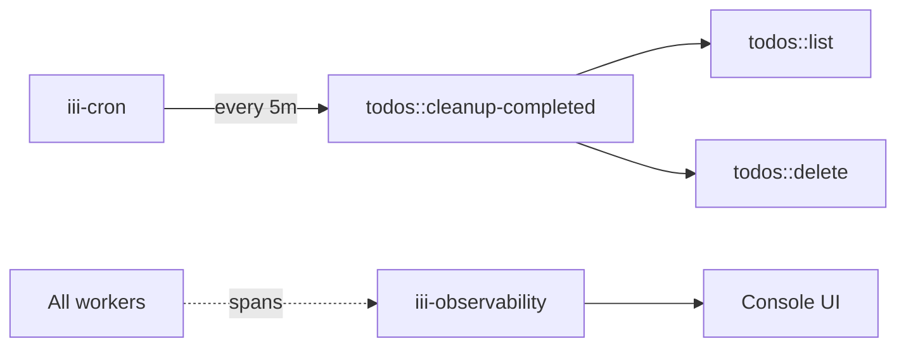

<Info title="Track 1 — Your first useful backend">
  This is tutorial **3 of 3** in Track 1. Estimated time: 15 minutes.
  Builds on [Tutorial 1](/tutorials/crud-api-in-10-minutes).
</Info>

## What you'll build

Add a recurring job that sweeps "completed" todos older than 24 hours and
deletes them — and use `iii-observability` to watch every invocation as a
distributed trace.

## Prerequisites

- Completed [Tutorial 1](/tutorials/crud-api-in-10-minutes).
- Engine running with `todo-worker` and `iii-http`.

## Steps

### 1. Add the cron and observability workers

```bash
iii worker add iii-cron
iii worker add iii-observability
```

{/* TODO: confirm whether iii-cron is bundled or must be installed; same for observability */}

### 2. Register a cleanup function

In a new worker file (TS or Python), register `todos::cleanup-completed`
that lists todos, filters by `completed_at < now - 24h`, and calls
`todos::delete` for each.

{/* TODO: code stub — small handler showing iii.invoke('todos::list'), filter, iii.invoke('todos::delete', id) */}

### 3. Bind a cron trigger

```yaml
{/* TODO: real cron trigger config — uses `expression` field, 7-field format.
   Example: every 5 minutes → "0 */5 * * * * *" bound to todos::cleanup-completed
*/}
```

### 4. Watch the trace

Open the iii console (`pnpm dev:console` or your deployed console URL).
Navigate to the **Traces** view. After the first cron tick you should
see:

```
cron:tick → todos::cleanup-completed → todos::list
                                     → todos::delete (×N)
```

{/* TODO: console screenshot path or link to /how-to/use-console */}

## Result

You scheduled work without installing a scheduler, and you have
distributed tracing without configuring OpenTelemetry. Both are workers
you added with one command each.

## What you just composed



## Next steps

- Move on to [Track 2](/tutorials/bridge-existing-api) to learn how to
  adopt iii in an existing stack.
- [How-to: Schedule a cron task](/how-to/schedule-cron-task)
- [How-to: Observability and logs](/how-to/observability-and-logs)
- [Reference: iii-cron](/workers/iii-cron) and
  [iii-observability](/workers/iii-observability).
