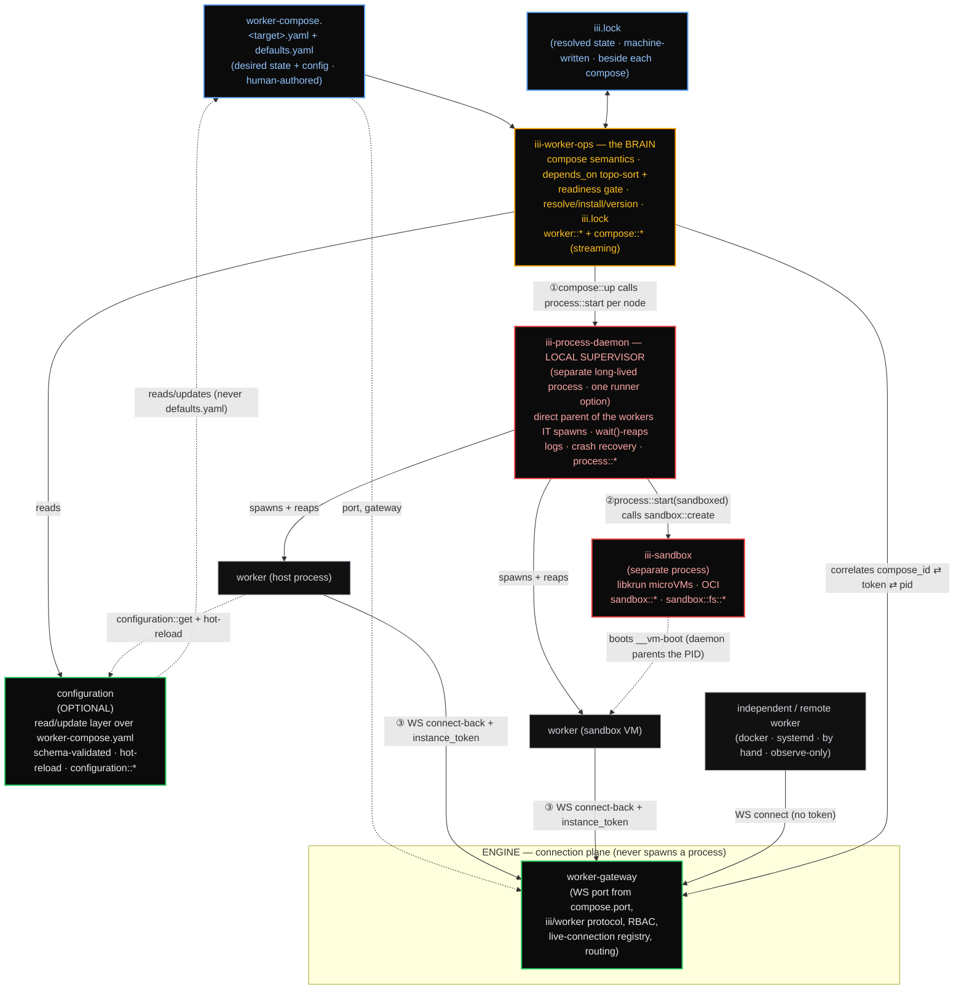

# iii Developer Experience Overhaul

A holistic redesign of how developers run, configure, and operate workers in **iii**, collapsing
today's tangle of process management, `config.yaml`, the `iii-worker-manager` worker, `iii-exec`,
sandboxes, and ~30 CLI leaf-commands into **declarative `worker-compose.<target>.yaml` files**,
**four clean planes**, and a **single CLI surface that is a thin wrapper over iii functions**.

This is the index. Each linked file owns one area in depth.

---

## The thesis (one breath)

iii's developer experience is rebuilt around human-authored declarative
**`worker-compose.<target>.yaml`** files (e.g. `worker-compose.dev.yaml`, `worker-compose.prod.yaml`):
each describes how to start a set of workers and carries the per-worker configuration overrides for
that target, while a worker's own shipped **`defaults.yaml`** supplies every value the compose file
does not override. A machine-written **`iii.lock`**, sitting beside each compose file, records resolved
versions and hashes (the package.json / lockfile split). The **engine** becomes a pure connection
plane: it binds the WS port natively from `compose.port`, runs the iii/worker protocol + the
live-connection registry + invocation routing, and it **never spawns an OS process and never manages a
worker**. A "running worker" is simply *any* process connected to the engine, started by anything (the
`iii-process-daemon`, docker, systemd/launchd, a bash script, by hand); the engine only **reports what
is available** and fires an *on-worker-available* trigger that `depends_on` subscribes to, including for
**remote** workers. Whatever process ran `iii worker compose up` is what supervises the workers it
started. The **`iii-process-daemon`** is that runner's local supervisor: for the workers *it* spawns it
is the direct parent (no `setsid` detach, no pidfiles, no `ps`-scan discovery), so it `wait()`-reaps its
own children and makes their orphans and zombies **impossible by construction**, absorbing today's
`iii-exec`. It is one option among many, not the universal owner of every PID. A separate
**`iii-worker-ops`** brain owns compose semantics (parse/merge/env-precedence, `depends_on` topo-sort +
trigger-gated readiness, resolve/install/version, `iii.lock`) and exposes `worker::*` + streaming
`compose::*` functions; on `up` it topo-sorts the graph and calls `process::start` per *local* node.
Per-worker configuration lives in the compose files themselves: a worker ships `defaults.yaml`,
`worker-compose.<target>.yaml` overrides what it needs, and the **optional** **`configuration`** worker
is a read/update layer over the active compose file (it edits `worker-compose.yaml`, never
`defaults.yaml`, and errors when no compose file is found). iii runs with zero workers, including no
`configuration` worker. The **CLI** consolidates into a small verb set, each a thin clap arm that
invokes a backing function over the same WS transport `iii trigger` already uses, so everything in the
CLI is also an iii function. The golden path collapses to
`curl|sh → iii project init → iii --compose → iii trigger` in one terminal (`iii --compose` starts the
engine and runs `compose up`), with `depends_on` readiness gating that kills the "Function not found"
race, while `config.yaml` and `worker-compose.yaml` coexist for ≥3 releases so production migrates
without an outage.

---

## Architecture: four planes, three meeting points



**How to read it.** Boxes are the components the spec defines. The dotted line from
`worker-compose.yaml` to the gateway is the **bootstrap floor** (just the `port` + listener config read
at boot; per-worker config is no longer a bootstrap concern). Solid arrows ①②③ are the **only three
places the planes touch**:

1. **`compose::up`** (on `iii-worker-ops`, streaming) is the *only* graph orchestrator — it
   topo-sorts, resolves each worker, and calls **`process::start`** per node, gating each on
   readiness. The daemon never speaks the compose graph.
2. **`process::start`** for a *sandboxed* worker calls **`sandbox::create`**, then the daemon
   parents the resulting `__vm-boot` PID. The daemon stays dumb about images; `iii-sandbox` owns
   libkrun/OCI.
3. **WS connect-back + `instance_token`** joins *process identity* (the local daemon's table) to
   *connection identity* (the engine registry). `iii-worker-ops` correlates them. A connection with a
   daemon-minted token is **daemon-supervised** (the runner that spawned it can stop/restart it); one
   without (docker, systemd, started by hand, or a remote worker) is **observe-only** to iii. The
   engine itself manages no worker either way.

---

## Component responsibility map

The authoritative table. No other file may redefine an owner or a function namespace.

| Component | Identity | Owns (authoritative for) | Never does | Functions |
|---|---|---|---|---|
| **Engine** | core process, not a worker (binary `iii`) | Binds the WS gateway port from `compose.port`; iii/worker protocol; RBAC handshake; **live-connection registry**; invocation routing; fires `worker_connected`/`worker_disconnected` and the **`worker_available`** trigger that reports what is reachable (incl. remote) | Spawn an OS process; **manage or supervise any worker**; own a PID; resolve versions; read worker scripts | routes all; owns none; manages none |
| **iii-worker-ops** (THE BRAIN) | worker id `iii-worker-ops`; **may** be an in-engine builtin | Compose semantics (parse + 5-layer merge over runtime/env/scripts/`config`/`depends_on`/`healthcheck` + env precedence — **`config` IS a merged field**: `defaults.yaml` ◁ compose base ◁ target overlay); `depends_on` graph (`name:`/`id:`, local or remote) → validate → cycle-detect → topo-sort → **trigger-gated readiness**; resolve/install/version (add/update/remove/clear); per-compose `iii.lock`; reconcile desired ↔ actual; the correlation map | Hold a `Child` handle; bind a socket; spawn a PID | `worker::{add,update,remove,clear,list,info,schema}`; `compose::{up,down,restart,status,validate}` |
| **iii-process-daemon** (LOCAL SUPERVISOR) | worker id `iii-process-daemon`; **separate long-lived process; one runner option among docker/systemd/bash** | Being the direct parent of the host PIDs **it itself spawns**; the authoritative table of *those* processes; spawn / killpg-group / `wait()`-reap; log capture; `instance_token` mint+inject; crash recovery; startup orphan sweep; restart policy + retry/backoff (timeouts may be `Inf`); absorbs `iii-exec` | Decide *what* to run; resolve versions; speak the compose graph; claim ownership of workers it did not spawn (docker/systemd/remote) | `process::{start,stop,restart,status,ps,logs,exec,signal,attach,reconcile}` |
| **iii-sandbox** | worker id `iii-sandbox`; **separate long-lived process** | microVM lifecycle (libkrun `__vm-boot`); OCI image pull/catalog/overlay; in-VM exec + fs; idle reaper (with a `keep_alive` carve-out for compose-managed sandboxed workers) | Be the parent of host (non-VM) workers | `sandbox::{create,run,exec,stop,list,catalog::list}` + `sandbox::fs::{…}` *(the bespoke `iii worker sandbox` CLI command retires once `iii trigger` gains async/streaming + upload/download — D9)* |
| **configuration** | worker id `configuration`; **OPTIONAL** (iii runs with zero workers, including this one) | A read/update layer over the **active `worker-compose.yaml`**: resolves effective config (`defaults.yaml` ◁ compose), validates `set` against the worker's JSON schema, expands `${VAR}` / `${VAR:default}` on read (opt-out via `raw: true`), fires the hot-reload trigger, and writes runtime changes **back into the compose file the worker was started from** | **Edit `defaults.yaml`**; be a separate `./data/configuration` store of record; run when no `worker-compose.yaml` is found (it errors) | `configuration::{register,set,get,list,schema}` |
| **iii-supervisor** | in-VM PID-1; unchanged | Guest-side process reaping inside each VM; Restart/Shutdown/Ping/Status over virtio-console | Anything host-side | guest protocol only |
| **migrate** | one-shot tool | `config.yaml` → `worker-compose.yaml`, carrying runtime/topology **and** per-worker `config:` blobs into the compose file | Run in steady state | `migrate::config_yaml` |

**Binary topology.** ONE binary `iii`. The process-daemon and sandbox-daemon run as **separate
long-lived processes of that same binary** via hidden subcommands (`iii __process-daemon`,
`iii __sandbox-daemon`) — true single-binary distribution *and* a process owner decoupled from
engine hot-reload. `iii-worker-ops` may be in-engine; the two daemons must not be.

---

## Canonical names

These names are fixed across every file. (Several of today's names were misleading — e.g.
`iii-worker-manager` never managed workers; it opened a port.)

| Concept | Canonical name | Note |
|---|---|---|
| Config worker | **`configuration`** | **OPTIONAL**. A read/update layer over the active `worker-compose.yaml`, not a `./data/configuration` store of record. A `config-worker` *worker* does not exist (it is an alias of the scheme below). |
| Config URI scheme | **`config-worker:<id>`** | The addressing scheme for a worker's config entry (entry id == worker id), resolved by the `configuration` worker against the active compose file (+ `defaults.yaml` fallback). Default when omitted: `config-worker:<workerid>`. |
| Worker default config | **`defaults.yaml`** | Ships with the worker; holds its default configuration. The `configuration` worker NEVER edits it; compose `config:` overrides it. |
| Local process supervisor | **`iii-process-daemon`** / namespace **`process::*`** | Reject `iii-daemon` / `daemon::*`. Supervises only the workers it spawns; one runner option among docker/systemd/bash. |
| Lifecycle/catalog brain | **`iii-worker-ops`** / namespaces **`worker::*`** + **`compose::*`** | — |
| WS listener / port | **`worker-gateway`** (internal engine concept) | No longer a worker. Was the misnamed `iii-worker-manager`; its config entry is deleted. |
| Sandbox worker | **`iii-sandbox`** / **`sandbox::*`**, **`sandbox::fs::*`** | Kept separate; public function API unchanged; the `iii worker sandbox` CLI command retires in favor of `iii trigger` (D9). |
| OCI/libkrun adapter | **`runtime-adapter`** (internal) | Belongs to `iii-sandbox`. |
| In-VM PID-1 | **`iii-supervisor`** | Unchanged; guest-only. |
| Arbitrary-process capability | **`process::start{spec, watch}`** | The `iii-exec` engine builtin is deleted. |
| Boot file | **`worker-compose.yaml`** / **`worker-compose.<target>.yaml`** | Replaces `config.yaml`'s worker list + the port indirection; carries per-worker `config:` overrides; per-target files (dev/prod/staging/testing/next). |
| Resolved lockfile | **`iii.lock`** | Keyed by `(package, version)`; **local to each `worker-compose.yaml`** (one lock per compose file, beside it). |
| Per-worker manifest | **`iii.worker.yaml`** | Permissive/untyped; compose overrides it field-by-field for runtime/scripts/env/`depends_on`/`healthcheck`. Default config ships in the worker's `defaults.yaml`; compose `config:` overrides that. |
| Per-spawn key | **`instance_token`** (`III_INSTANCE_TOKEN`) | Plus `III_COMPOSE_ID`, `IIIWORKER_PORT`. |
| Migration tool | **`iii migrate`** / **`migrate::config_yaml`** | — |
| Compose lifecycle command | **`iii worker compose …`** (`up`/`down`/`restart`/`logs`/`status`/`validate`/`generate-docker`) | The canonical surface. Tutorial one-liner: **`iii --compose`** (start engine + `compose up`); bare **`iii`** starts the engine only. No top-level `iii up`/`iii down`/`iii ps`/`iii logs`. |
| Trigger timeout | **`iii trigger --timeout <secs\|Inf>`** | Default 60s; `Inf` = wait forever. Applies to start/drain/healthcheck timeouts too (D6). |
| VM egress field | **`runtime.egress: bool`** | Renamed from `runtime.network`; it is VM-egress, not inter-worker networking. |

---

## Design principles

1. **Declarative compose files, one per target.** A human edits `worker-compose.yaml` (and
   `worker-compose.dev.yaml` / `worker-compose.prod.yaml` / etc.). Each is the boot egg (port + worker
   topology + per-worker config overrides) and nothing else is required to stand up a project.
2. **Compose = desired state; `iii.lock` = resolved state.** Floating tags, topology, and config
   overrides live in compose; concrete versions and hashes live in the machine-written lock that sits
   beside each compose file. `up` is reproducible (replays the lock); `update` is the explicit re-pin.
3. **The engine never spawns and never manages a worker.** It is a pure connection/protocol/RBAC/
   registry/routing/reporting plane. The single biggest structural simplification: the engine's
   `cmd.spawn` paths are deleted, and lifecycle ownership leaves the engine entirely.
4. **The runner that started a worker supervises it.** A "running worker" is any process connected to
   the engine, started by anything (the daemon, docker, systemd, bash, by hand). For the workers it
   spawns, `iii-process-daemon` is the direct parent and `wait()`-reaps them, so the only way to make
   a zombie (detach and drop the handle) is removed for daemon-started workers. iii does not own
   externally-started or remote workers; it reports them as available.
5. **The CLI is a thin wrapper over functions.** Every command is `parse → typed options → invoke
   the backing function over WS → render`. No business logic in the CLI; consent/prompts live only
   in the wrapper. Everything is scriptable via the same functions and `--json`.
6. **Config lives in the compose files, with a `defaults.yaml` floor.** A worker ships its default
   config in `defaults.yaml`; `worker-compose.<target>.yaml` overrides per target; anything not
   overridden falls back to `defaults.yaml`. The optional `configuration` worker reads the effective
   value and writes runtime changes back into the active compose file (never `defaults.yaml`).
7. **Override, never the reverse.** A worker ships `iii.worker.yaml` (start/runtime defaults) and
   `defaults.yaml` (config defaults); `worker-compose.yaml` overrides both field-by-field (maps
   deep-merge; lists/scalars replace). Config is no longer an exception: it is a merged field like the
   rest.

---

## Cross-cutting contracts

Five contracts span more than one file. They are fixed **here** so the per-area files stay
consistent; each file implements its slice and links back to this section.

### Project identity = the listener `port`

A machine can run several projects/engines at once, and two projects can both name a worker `math`.
So the unit of isolation is the **listener `port`** (the one fact every plane already holds):

- The process daemon's lock and state live under **`~/.iii/daemon/<port>/`** (`daemon.lock`,
  `state.json`), so a `down` by one runner can never reap another runner's PIDs.
- Per-worker config lives **in the compose file itself** (`config:` blocks), with the worker's
  `defaults.yaml` as the floor. There is no separate `./data/configuration` store directory to anchor.
  Relative paths in a compose file (`runtime.workspace`, `env_file[*]`, any `config.path` to a local
  file) resolve **relative to that compose file's directory** (not the CWD that ran `up`), so each
  compose file is its own project scope and two projects never collide.
- The correlation key that joins a connection to a daemon-supervised process is **`(port, compose_id,
  instance_token)`**; `compose_id` alone is not globally unique.

Detail: [process-daemon.md](process-daemon.md) (daemon keying), [configuration-and-bootstrap.md](configuration-and-bootstrap.md) (store path), [engine-and-gateway.md](engine-and-gateway.md) (correlation key).

### Hot-reload / stop drain protocol

Killing a worker PID makes the engine `halt_invocation` every in-flight call to it
(`engine/mod.rs:1700-1706`) — so a naive restart drops requests. The drain is a three-party
contract: **`iii-worker-ops`** orchestrates it (in `compose::*` reconcile / `restart`), the **engine**
quiesces (stops routing *new* invokes to the instance and reports the in-flight count), and the
**daemon** executes `process::stop` with `SIGTERM → grace → SIGKILL → wait()`. Default drain timeout
**30s**, per-worker overridable; `Inf` waits forever and `0` force-halts immediately. On a finite
expiry the remaining invocations are force-halted (callers get `invocation_stopped`), logged, and
surfaced as a `ComposeEvent` ("drained N, force-halted M"). Restart uses capped exponential backoff
(D6). Blue/green zero-downtime reload is a **future** option for stateless workers, not a day-1
promise. Detail: [engine-and-gateway.md](engine-and-gateway.md).

### Registration-collision rule

An untokened (independent) connection that registers a `compose_id` already owned by a managed
instance is **rejected** (and logged); the managed instance keeps the id and its function routing.
`instance_token` gates *control*; this rule gates *registration*. Detail:
[engine-and-gateway.md](engine-and-gateway.md), [process-daemon.md](process-daemon.md).

### The `health::check` convention

L2 readiness (`condition: healthy`, the `healthcheck:` block) calls a function the worker exposes.
The conventional default name is **`health::check`** — not hard-reserved; a `healthcheck:` block may
name any `function_id` (or run a `command`). A `depends_on … condition: healthy` on a worker that
declares no `healthcheck:` is a validation error. Detail: [worker-compose.md](worker-compose.md)
(the block), [lifecycle-and-onboarding.md](lifecycle-and-onboarding.md) (the L0/L1/L2 contract).

### Canonical exit codes

CLI errors equal function errors: `WorkerOpErrorKind` W-codes (`crates/iii-worker/src/core/error.rs`)
map to small stable process exit codes. This table is canonical; other files cross-link it.

| W-code | Kind | Exit |
|---|---|---|
| W100 | `InvalidName` | 2 |
| — | lock-drift (`compose up --frozen` / `validate --frozen`) | 3 *(preserves `sync --frozen`'s contract)* |
| W110 | `NotFound` | 4 |
| W104 | `ConsentRequired` | 5 |
| W120 | `LockBusy` | 6 |
| W161 | `StartTimeout` | 7 |
| (other) | `Internal` / IO / Registry | 1 |

Under `--json`, errors also emit `{ "error": { "code", "kind", "message" } }`. Detail:
[cli-and-functions.md](cli-and-functions.md).

A sixth net-new field, **`ConfigurationEntry.secret: bool`**, is shared by
[secrets.md](secrets.md) (the redaction rules) and [configuration-and-bootstrap.md](configuration-and-bootstrap.md)
(the config contract: `register`/`set` preserve it; every read path redacts to `***` unless
`reveal: true`). Secrets still never go inline in the committed compose file; they ride `env_file` +
`${VAR}` (see [secrets.md](secrets.md)).

---

## The spec

| File | What it owns |
|---|---|
| [worker-compose.md](worker-compose.md) | The `worker-compose.yaml` schema: top-level shape, the per-worker block, the 5-layer merge chain (now including `config`), the per-worker `config:` block + `defaults.yaml` floor, **targets** (dev/prod/staging/testing/next), env precedence, `runtime`/`egress`, `depends_on` (`name:`/`id:`, local + remote), `healthcheck` + retry/backoff (timeouts may be `Inf`), format versioning, the worked examples, validation error catalog, the typed serde schema, per-compose `iii.lock`, `-f`/target overlays. |
| [engine-and-gateway.md](engine-and-gateway.md) | The engine as a pure connection plane that **manages nothing**: boot sequence (floor = `port` only), baking the WS gateway in (deleting `iii-worker-manager`), the unified registration protocol for the worker kinds + `instance_token`, the **`worker_available`** trigger + remote `depends_on`, RBAC carry-over, and the **hot-reload drain protocol** (`Inf`-capable timeouts). |
| [process-daemon.md](process-daemon.md) | `iii-process-daemon` as the **local runner's supervisor** (one option among docker/systemd/bash): the spawn/stop primitives, the zombie root-cause → mechanism table for daemon-spawned workers, retry/backoff + `Inf` timeouts, supervision tiers, logs (ring buffer vs `iii-observability`), crash recovery, multi-runner keying, the sandbox idle-reaper carve-out, and the Windows ruling. |
| [cli-and-functions.md](cli-and-functions.md) | The unified CLI tree (`iii worker compose …` canonical + `iii --compose`); the **command → function → owner** contract; the thin-wrapper + bootstrap architecture; `iii trigger --timeout`, the `worker::*`/`trigger::console` reductions; the function-id compatibility layer; output formats; the migration alias map. |
| [configuration-and-bootstrap.md](configuration-and-bootstrap.md) | Killing `config.yaml`: the (now one-fact) bootstrap floor, the boot sequence, the `config.yaml`-entry → compose-`config:` migration table, the `defaults.yaml` floor + compose override chain, `config-worker:<id>` resolution against the active compose file, the **optional** configuration worker that reads/updates compose (never `defaults.yaml`, errors if no compose), restart-tier vs live, and `iii migrate`. |
| [secrets.md](secrets.md) | Secret handling: secrets never inline in the committed compose file, `env_file` never persisted, `${VAR}` as the recommended path, the `secret: true` redaction tag, `.gitignore` guidance, cloud handoff, and the out-of-scope line. |
| [lifecycle-and-onboarding.md](lifecycle-and-onboarding.md) | The DX payoff: the golden path, `iii project init`/`iii --compose` semantics, the **onboarding & activation journey** (interactive tutorial, email capture → Mailmodo, PostHog activation, testable tutorials), hot-reload, day-2 ops, error DX, the **readiness contract** (L0/L1/L2), the testing/CI story, and the docs restructure. |
| [migration.md](migration.md) | The 6-phase rollout, the `config.yaml`/compose coexistence bridge (config blobs carried INTO compose), the `managed.rs` decomposition, the test blast radius, the **cloud cutover**, the **multi-host hub** ruling, and the TUI/console/cloud co-migrations. |

---

## `worker-compose.yaml` at a glance

```yaml
version: "1"
port: 49134                                  # the WS gateway port (the ONLY bootstrap fact)

workers:
  math-worker:                               # local source worker
    runtime: { workspace: ./workers/math-worker }
    scripts: { install: npm install, start: npm run dev }
    config:                                  # overrides the worker's shipped defaults.yaml
      precision: 8

  caller-worker:
    runtime: { workspace: ./workers/caller-worker }
    depends_on:
      - name: math-worker                    # by type; gated on readiness via a trigger
    environment: { LOG_LEVEL: debug }        # overrides iii.worker.yaml

  state:                                     # remote registry worker, pinned in iii.lock
    runtime: { package: workers.iii.dev/iii-state:latest }

# Per-target overrides (package.json-like). Equivalently a separate worker-compose.prod.yaml.
targets:
  production:
    workers:
      math-worker:
        scripts: { start: npm run start }
        config: { precision: 16 }
```

There is no top-level `configuration:` block: per-worker config lives in each worker's `config:` block
(over its `defaults.yaml`), not in a separate store. See [worker-compose.md](worker-compose.md) for the
full schema and the worked examples.

---

## Scope

**In scope (v1):** development and self-hosting; the four-plane runtime; the unified CLI + function
API; `config.yaml` migration; secrets-at-rest hygiene; the **multi-host hub** model (one shared engine;
workers connect from any host, started by anything; remote `depends_on` resolved via the
`worker_available` trigger; multiple machines each running `iii worker compose up` against the same
engine).

**Out of scope (stated explicitly so the boundary is clear):**

- **Cross-host lifecycle management (v1).** The engine manages no worker; each runner
  (`iii-process-daemon`, docker, systemd, bash) supervises only the workers it started on its own host.
  iii reports remote workers as available and lets you `status`/inspect them across hosts via the
  engine, but cross-host `stop`/`restart` is not a v1 promise. Fleet-scale orchestration is iii Cloud's
  job, see [migration.md](migration.md).
- **Inter-worker networking.** Workers communicate only via functions over the engine bus; there are
  no service IPs/ports between workers. Docker-style `networks:` is not adopted. `runtime.egress`
  controls a sandbox VM's outbound internet, nothing more — see [worker-compose.md](worker-compose.md).
- **A real secrets backend** (Vault/SSM/age). v1 ships file-only `env_file` + `${VAR}` + redaction; the
  `configuration` adapter is the seam for a future `secret` backend — see [secrets.md](secrets.md).
- **Native Windows.** v1 is WSL-only; the daemon's `spawn_owned`/`stop_owned` is the seam for a
  future Job-Objects backend — see [process-daemon.md](process-daemon.md).
- **Host-process resource limits (cgroups/rlimits).** Sandbox VMs already cap CPU/memory; host
  processes are dev-trusted in v1.

---

## Open questions to ratify

These are the genuinely unresolved trade-offs surfaced during design review. Each has a recommended
default; the spec proceeds on the default unless overruled. (Detail in the owning file.)

| # | Question | Recommended default | Owner file |
|---|---|---|---|
| OQ-1 | Top-level `iii up/down/ps/logs` vs `iii worker compose …`? | **Ratified: `iii worker compose …` is canonical; `iii --compose` is the tutorial one-liner (engine + `compose up`); bare `iii` starts the engine only. No top-level `iii up/down/ps/logs`.** | cli-and-functions |
| OQ-0a | Where does per-worker config live? | **Ratified: in the `worker-compose.<target>.yaml` `config:` blocks over the worker's `defaults.yaml`; the `configuration` worker is OPTIONAL and reads/updates the active compose file (never `defaults.yaml`).** | configuration-and-bootstrap |
| OQ-0b | Multi-host? | **Ratified: hub model. The engine manages nothing and reports availability via `worker_available`; remote `depends_on` is allowed; lifecycle management is local-per-runner in v1.** | migration |
| OQ-2 | Multi-engine daemon keying (two projects, one machine). | **Daemon per engine/port** — lock+state under `~/.iii/daemon/<port>/`; resolve relative paths against the compose file dir. | process-daemon |
| OQ-3 | Hot-reload drain protocol. | **Drain** (stop new invokes, bounded wait, then SIGTERM); timeout per-worker overridable, `Inf`/`0` allowed; blue/green later for stateless workers. | engine-and-gateway |
| OQ-4 | Daemon crash recovery on macOS (no subreaper). | **Documented degraded mode**: best-effort re-adopt + startup orphan sweep. | process-daemon |
| OQ-6 | `iii.lock` keying for two copies with divergent versions. | **Key by `(package, version)`.** | worker-compose |
| OQ-7 | libkrun-unavailable hosts (Intel Mac / no-KVM / CI). | **Partial up** — preflight gate, sandbox workers SKIPPED, host workers still come up. | worker-compose |
| OQ-8 | Compose format versioning. | **`version` required + semver**; minor = additive (warn-and-ignore unknown keys within a major); major = hard refuse. | worker-compose |
| OQ-9 | Comment-preserving compose edits on `add`/`remove` and on `configuration::set` writing config back to compose. | **Preserve comments/formatting on round-trip** (the configuration worker now edits `worker-compose.yaml` at runtime, so a destructive re-serialize would churn the human-authored file); prefer a format-preserving YAML editor over a plain struct re-serialize. | worker-compose |
| OQ-10 | `--frozen` exit-code contract when `sync` folds into `compose up`. | **Preserve the drift exit-code/W-code** so CI keeps failing on drift. | migration |
| OQ-11 | Inter-worker networking. | **None** — function bus only; rename `network`→`egress`; `networks:` out of scope. | worker-compose |
| OQ-12 | Artifact GC for machine-global `~/.iii/`. | **`iii worker clear --unused`** intent stated; host rlimits out of scope. | cli-and-functions |
| OQ-13 | Compose-level `defaults:` block. | **Keep it** (the merge engine + migrate tool account for it). | worker-compose |

---

## Phased migration at a glance

`config.yaml` and `worker-compose.yaml` **coexist for ≥3 releases** behind a format-detection bridge.
The end state is reached in six phases; full detail, entry/exit criteria, and the cloud cutover are in
[migration.md](migration.md):

```
Phase 0  Dual-parser — compose lowered to today's EngineConfig (no behavior change, --compose flag)
Phase 1  per-compose iii.lock split + `iii migrate` (carries config: blobs into compose)
Phase 2  Per-worker config in compose config: over defaults.yaml; configuration worker reads/updates compose, one worker at a time (see note)
Phase 3  The iii-process-daemon (flag-gated; the risky middle; ~10 PRs)
Phase 4  Bake the gateway into the engine; delete iii-worker-manager + iii-exec entries (cloud canary)
Phase 5  Remove config.yaml + CLI/function alias cleanup
```

> **Phase 2 reuses shipped work.** All seven built-in workers (`iii-state`, `iii-stream`,
> `iii-pubsub`, `iii-cron`, `iii-queue`, `iii-observability`, `iii-http`) already externalize their
> config via `configuration::{register,get}` and hot-reload off the `configuration` trigger; that
> externalization is reused directly. What changes is the **source of truth**: instead of a
> `./data/configuration` store, the value resolves from the worker's `defaults.yaml` overridden by the
> active `worker-compose.yaml` `config:` block, and `configuration::set` writes runtime changes back
> into that compose file. Remaining: point the seven workers' config read/write at the compose-backed
> store, and let external/third-party workers ship a `defaults.yaml`.

---

## Relationship to today's code

This overhaul is **mostly a re-wiring of sound machinery, not a rewrite** — with one genuinely
net-new build (the supervisor substrate in `iii-process-daemon`). The WS listener and iii/worker
protocol (`engine/src/workers/worker/`) already exist and need zero protocol changes; the
`worker::*` function API already exists on today's worker-ops daemon; the correct process-ownership
primitive already exists in two places (`engine/src/workers/external.rs`,
`engine/src/workers/shell/exec.rs`) and is generalized to all process kinds; the `configuration`
worker, the `iii.lock` resolver, and the sandbox daemon all exist and are reused. What changes is
*ownership and config source*: the port moves from a worker entry to `compose.port`; per-worker
config's source becomes the worker's `defaults.yaml` overridden by the `worker-compose.yaml` `config:`
block (the optional `configuration` worker reads and updates the active compose file, reusing the
`configuration::*` externalization already live for the seven built-in workers); the engine stops
managing worker lifecycles entirely (it only reports availability); and the detached spawn paths (the
zombie sources) collapse into the local supervisor's one reaping parent for the workers it spawns. The
research that grounds every claim, twelve subsystem investigations, six design proposals, and four
adversarial critiques, is summarized per-file with `path:line` citations.
