# Configuration & Bootstrap: killing config.yaml; defaults.yaml + compose config:; the bootstrap floor

This file specifies how `config.yaml` dies and where its two responsibilities go. It defines the
**bootstrap floor** (the irreducible set of facts the engine must know before any worker can answer
a function call) and the **per-worker config model**: a worker ships its own `defaults.yaml`, the
user's `worker-compose.<target>.yaml` carries the `config:` overrides, and the **optional**
`configuration` worker reads the effective value and writes runtime changes back into the active
compose file. There is no separate `./data/configuration` store of record. It also defines the
`config-worker:<id>` addressing scheme, the boot sequence, env precedence (env and config are
orthogonal namespaces), the optional-not-mandatory rule for the `configuration` worker, and the
`iii migrate` tool. Schema for the compose file itself lives in
[worker-compose.md](worker-compose.md); the engine boot and baked-in gateway live in
[engine-and-gateway.md](engine-and-gateway.md); process ownership lives in
[process-daemon.md](process-daemon.md); env-precedence detail and secret handling live in
[worker-compose.md](worker-compose.md) and [secrets.md](secrets.md).

---

## 1. The thesis: config.yaml is only a worker list + seed blobs

The engine's *entire* config schema today (`engine/src/workers/config.rs:28-35`) is two lists of
worker entries:

```rust
#[derive(Debug, Deserialize)]
#[serde(deny_unknown_fields)]
pub struct EngineConfig {
    #[serde(default)] pub modules: Vec<WorkerEntry>,
    #[serde(default)] pub workers: Vec<WorkerEntry>,
}
```

A `WorkerEntry` is just `{ name, image?, config? }` (`config.rs:170-177`), where `config` is an
opaque `serde_json::Value`. There is **no top-level `port`, no engine-global section, no security
section** — `deny_unknown_fields` accepts only `modules:` and `workers:`. So `config.yaml` is not a
config tree; it is *only* a list of which workers to start plus a per-worker seed blob each.

Killing it re-homes **exactly two responsibilities**:

1. **The static bootstrap floor** (facts that must be known *before any worker exists*). This shrinks
   to **one irreducible fact, the WS gateway `port`** (plus optional `gateway:` listener knobs), and
   moves to **`worker-compose.yaml`** (see [worker-compose.md](worker-compose.md)). There is no
   store-location to bootstrap.
2. **Per-worker runtime config** (every `config:` blob). This re-homes to the worker's shipped
   **`defaults.yaml`** overridden by the per-worker **`config:`** block in
   `worker-compose.<target>.yaml`. Effective config per worker = `defaults.yaml` ◁ compose base
   `config:` ◁ active target overlay; anything not overridden falls back to `defaults.yaml`. The
   **optional** `configuration` worker mediates this at runtime: it reads the effective value and, on
   `configuration::set`, writes the change back into the active compose file (never `defaults.yaml`).

This split is dictated by a chicken-and-egg constraint (the `configuration` worker, when present, is
reachable only over the gateway port), not taste. The bootstrap floor is now a single fact (§2).
Everything else is per-worker config carried by `defaults.yaml` + compose, and the codebase has
already externalized two workers (`iii-state` #1860, `iii-observability` b38a5646) through the
`configuration::*` surface that this model reuses.

> **Naming note (canonical).** `config-worker` is a **URI scheme**, not a worker. There is no
> `config-worker` worker. `config-worker:<id>` is the addressing scheme for a worker's config entry,
> resolved by the worker whose id is **`configuration`** against the active `worker-compose.yaml`
> (with `defaults.yaml` as the floor). Do not introduce a `config-worker` worker anywhere.

---

## 2. The bootstrap floor (one irreducible fact)

The floor is the minimal set the engine must resolve *statically* (off the compose file, before any
worker exists). It is now a single fact, the gateway `port`. The old store-location fact is deleted
(there is no store), and early-boot config reads now come from the compose + defaults that are
already parsed at boot, not from a separate disk store.

| Fact | What it is | Source today | Why it must be resolved at the floor |
|---|---|---|---|
| **B1 (the WS gateway port)** | The single TCP port SDK workers connect to (default `49134`); the optional `gateway:` listener knobs (host/rbac/middleware) ride alongside it. | Scanned out of the `iii-worker-manager` worker entry's `WorkerManagerConfig.port` in `EngineBuilder::build` (`config.rs:672-679`), fallback `DEFAULT_PORT` (`worker/mod.rs:36`). | The `configuration` worker, when present, is reachable **only over this port**. You cannot read the port from the thing the port lets you reach. It is the one fact every plane already holds (project identity, README). |
| ~~B2 (the configuration store location)~~ | **DELETED.** There is no `./data/configuration` store of record. The compose file (+ each worker's `defaults.yaml`) IS the persistence; there is no store directory to bootstrap. | n/a | n/a |
| **B3 (early-boot config, read from the already-parsed compose + defaults)** | Config consumed before any worker is up, e.g. logging/trace init reads `iii-observability`. | Resolved at boot from the worker's `defaults.yaml` ◁ the active compose `config:` block, which the engine has already parsed in step [1] (with `${VAR}` expansion + `catch_unwind` fallback, per the b38a5646 precedent). | The value is needed *before that worker is up*, but it is not a separate disk-store read: the compose file and the worker's `defaults.yaml` are already in memory once the compose file is parsed, so early-boot consumers read the resolved value directly. |

**Bootstrap floor = `{ port }` (plus the optional `gateway:` knobs); one irreducible fact. Nothing
else needs to be resolved before workers exist.** B1 collapses the entire `config.rs:672-679` scan
into a single top-level field read; B3 is not a new disk read but a read of the
`defaults.yaml`-over-compose value already parsed at boot.

The B1 scan deletion concretely: the seven-line `workers.iter().find("iii-worker-manager")…` block at
`config.rs:672-679` becomes `self.engine.set_worker_manager_port(compose.port)`.

---

## 3. The bootstrap-static-vs-per-worker-config line

What is bootstrap-static (resolved at the floor, before workers exist) vs what is per-worker config
(lives in the compose `config:` block over the worker's `defaults.yaml`, hot-reloadable via the
optional `configuration` worker), exhaustively:

| Bootstrap-static (read at the floor, before workers exist) | Per-worker config (compose `config:` over `defaults.yaml`; hot-reloadable via the optional `configuration` worker) |
|---|---|
| **`port`** (the WS gateway port, B1). The `configuration` worker, when present, is reachable only over it. | Every per-worker `config:` value: `iii-stream`, `iii-queue`, `iii-pubsub`, `iii-cron`, `iii-http`, `iii-bridge`, `iii-sandbox`, the runtime slice of `iii-observability`, etc. Effective value = the worker's `defaults.yaml` ◁ compose base `config:` ◁ active target overlay. |
| **`gateway:`** (host / rbac / middleware listener knobs), bound when the port binds. | Per-worker schema-validated values, addressed by id (`config-worker:<id>`), `${VAR}`-expanded on read, watched for hot-reload via the `configuration` trigger type. The default lives in the worker's `defaults.yaml`; the compose `config:` block overrides it. |
| **The worker list + topology**: which workers, their `runtime`, `scripts`, `depends_on`, `environment`, `env_file`, and their per-worker `config:` overrides. | The *live* slice of any worker's config (e.g. log-level changes that apply without restart). `configuration::set` writes the change back into the active compose file. |

> Top-level compose shape (canonical; see [worker-compose.md](worker-compose.md) for full schema):
> `version`, `port`, `gateway:`, `defaults:`, `workers:` (each worker entry may carry a `config:`
> block). There is **no top-level `configuration:` store-location block**: there is no store of
> record to locate. Per-worker config lives in each worker's `config:` block over its `defaults.yaml`.

```yaml
version: "1"
port: 49134                          # B1, the WS gateway port (the ONLY bootstrap fact)
gateway: { rbac: ... }               # optional listener knobs, bound when the port binds

workers:
  iii-observability:
    runtime: { package: workers.iii.dev/iii-observability:latest }
    config:                          # overrides the worker's shipped defaults.yaml
      service_name: my-app
```

The `bridge` case (delegating config reads to a remote engine's `configuration` worker) is expressed
as a per-worker `config:` pointer (`config-worker:<id>` against a remote source), not a top-level
store-location block; see §6.

---

## 4. The new boot sequence

The whole point of the floor is ordering. The engine binds the port *before* anything else, reads
early-boot (restart-tier) config from the compose + defaults it has already parsed, then starts the
worker graph; each worker reads its effective config at runtime. The `configuration` worker is
**optional** and is **not** auto-injected; if a runner declares it, it comes up like any other worker.
The engine never spawns a PID; a runner does (see [process-daemon.md](process-daemon.md)). See
[engine-and-gateway.md](engine-and-gateway.md) for the gateway-binding detail.

```mermaid
flowchart TD
    A["bare `iii` → run_serve (main.rs:222) [engine only]<br/>or `iii --compose` / `iii worker compose up` → compose::up"] --> B
    B["[1] PARSE worker-compose.yaml (active target)<br/>expand ${VAR:default} over text (config.rs:47-76)<br/>read port, gateway, workers (+ each worker's config:)<br/>NO config.yaml read; NO worker-entry port scan"] --> C
    C["[2] BIND gateway (the WS listener)<br/>engine.set_worker_manager_port(compose.port) (config.rs:679)<br/>TcpListener {host}:{port} (worker/mod.rs:121-131)<br/>apply compose.gateway.rbac<br/>━ port open; nothing else started ━"] --> D
    D["[3] RESOLVE early-boot (restart-tier) config from the already-parsed compose + defaults (B3)<br/>effective = worker defaults.yaml ◁ compose config: (◁ target overlay)<br/>expand ${VAR}; catch_unwind bad value → fall back to defaults.yaml<br/>init logging/tracing<br/>━ no separate disk store read; the values are already in memory ━"] --> G
    G["[5] START workers in depends_on order (none are auto-injected; runs only what compose declares)<br/>each spawned by a runner (e.g. the process-daemon), NOT the engine<br/>(orchestrated by worker-ops compose::up; see process-daemon.md)<br/>worker connects over WS → RBAC handshake → WorkerRegistered"] --> H
    H["[6] WORKERS READ CONFIG at runtime<br/>effective value = defaults.yaml ◁ compose config: (◁ target). If the OPTIONAL configuration worker is present,<br/>read via configuration::get{id} (env-expanded) and tell it which compose file you started from<br/>register_config_trigger to hot-reload on configuration:updated (#1860)<br/>━ the compose file (+ defaults.yaml), not a ./data store, is the source of truth ━"] --> I
    I["[7] WATCH for changes<br/>compose-file watcher: topology change → reconcile worker set<br/>configuration trigger fan-out: value change → live hot-reload<br/>  or log 'applies at next start' (restart-tier)"]
```



Key inversions vs today:

- **B1 is one top-level field**, not a worker-entry scan (`config.rs:672-679` deleted).
- **The port binds before any worker starts**, correct, because the gateway is the *transport* the
  `configuration` worker (when present) is reached over.
- **Early-boot config is read from the already-parsed compose + defaults (step 3)**, not from a
  separate `./data` store and not after a store worker comes up; there is no store worker to wait for.
- **The `configuration` worker is optional and never auto-injected.** iii runs with zero workers; if
  no `configuration` worker is declared, config is static (`defaults.yaml` ◁ compose, resolved at
  start) and there is no runtime hot-reload path.

---

## 5. config.yaml-entry → destination migration table

Every worker entry in `engine/config.yaml` (plus the canonical `iii-worker-manager` port holder,
which lives in cloud configs like `registry/api/iii-config-production.yaml`). Destinations:
**(a)** → compose top-level (bootstrap); **(b)** → the worker's per-worker compose `config:` block
(over its `defaults.yaml`); **(c)** → deleted; **(d)** → engine flag/env. Per-worker `config:` blobs
are **carried into** the compose `config:` block, not dropped and not into a store.

| config.yaml entry (file:line) | What its `config:` holds | Dest | Exact placement |
|---|---|---|---|
| `iii-worker-manager` (port holder; `WorkerManagerConfig` `worker/mod.rs:52-66`) | `port`, `host`, `rbac`, `middleware_function_id` | **(a)+(c)** | `port` → compose top-level `port:` (B1). `host`/`rbac`/`middleware_function_id` → compose `gateway:`. The *worker entry itself is **deleted*** (the gateway is baked into the engine, see [engine-and-gateway.md](engine-and-gateway.md)); it is no longer a YAML worker. |
| `configuration` (`config.yaml` L148-156; `ConfigurationModuleConfig` `configuration/config.rs:13-25`) | `adapter{fs, directory}`, `ttl_seconds` | **(c)** | **Deleted.** There is no store-location to migrate: the compose file (+ `defaults.yaml`) is the persistence. If a runner wants the optional `configuration` worker, it declares it like any other worker (no top-level block). |
| `iii-observability` (`config.yaml` L23) | `enabled`, `service_name`, `exporter`, `endpoint`, sampling, metrics, logs | **(b), restart-tier** | `workers.iii-observability.config:` over its `defaults.yaml`. The logging/trace slice is **early-boot** (B3), resolved at the floor from the already-parsed compose + defaults. |
| `iii-state` (`config.yaml` L15) | `adapter{kv,file_path}` | **(b), externalized** | Already externalized via `configuration::*` (#1860). `workers.iii-state.config:` over its `defaults.yaml`. `adapter` is restart-tier; live fields apply instantly. |
| `iii-stream` (`config.yaml` L2) | `port`, `host`, `adapter{redis/kv}` | **(b)** | `workers.iii-stream.config:`. **`iii-stream.port` (3112) is a DATA-PLANE per-worker port, NOT the bootstrap gateway port**, so it is a `config:` value, not compose top-level `port`. (Restart-tier: a rebind needs worker restart.) |
| `iii-queue` (`config.yaml` L131) | `adapter{redis}` | **(b)** | `workers.iii-queue.config:`. Pure per-worker. |
| `iii-pubsub` (`config.yaml` L138) | `adapter{local}` | **(b)** | `workers.iii-pubsub.config:`. |
| `iii-cron` (`config.yaml` L143) | `adapter{kv}` | **(b)** | `workers.iii-cron.config:`. |
| `iii-http` (`config.yaml` L200) | `port: 3111`, `host`, `default_timeout`, `concurrency_request_limit`, `cors` | **(b)** | `workers.iii-http.config:`. **The HTTP ingress port is data-plane per-worker config (restart-tier), NOT the bootstrap gateway port** → `config:`, not compose top-level. |
| `iii-bridge` (`config.yaml` L158) | remote `url`, `service_id`, forward/expose | **(b)** | `workers.iii-bridge.config:`. Per-worker. |
| `iii-sandbox` (`config.yaml` L176) | `image_allowlist`, idle timeout, cpus, memory, custom_images | **(b)** | `workers.iii-sandbox.config:`. (Sandbox-runtime defaults; runtime mapping in the sandbox spec.) |
| `iii-exec` (`registry/api/iii-config*.yaml`; `ExecConfig{watch,exec}` `shell/config.rs:9-14`) | `watch`, `exec: [cmd…]` | **(c) from config.yaml; capability → process-daemon** | The `iii-exec` *engine builtin* is deleted. `exec: [cmd]` → a compose worker with `scripts.start`; `watch:` → a daemon-level watch via `process::start{spec, watch}`. See §11 and [process-daemon.md](process-daemon.md). |
| `modules:` top-level key (`config.rs:31`) | list of built-in workers | **(c)** | Folded into the single `workers:` map. The `modules`/`workers` split disappears; nothing is auto-injected (§10), only what compose declares runs. |
| `--config` engine flag (`main.rs:99-101`, default `config.yaml`) | path to boot file | **(d)** | Becomes `--compose worker-compose.yaml` (default `worker-compose.yaml`). `--config` keeps accepting `config.yaml` through the coexistence window (see [migration.md](migration.md)). `--use-default-config` → `--use-defaults`. |
| `${VAR:default}` expansion (`config.rs:47-76`) | inline templating | **kept** | Reused for both compose file text and per-worker `config:` values (expand on read). |

The only deletions are the entries design retires (`iii-worker-manager` entry, the
`configuration` store-location block, the `iii-exec` builtin, `modules`). Everything substantive is
(a) bootstrap or (b) carried into the per-worker compose `config:` block over its `defaults.yaml`; the
only hard constraint was ordering (§2), now reduced to the single `port` fact.

`config.prod.yaml` / `iii-config-production.yaml` (`iii-http`, `iii-cron`, `iii-observability`,
`iii-exec`) map the same way, as a thin `worker-compose.prod.yaml` overlay (target layering, §12.3).
The cloud is the highest-stakes surface; see [migration.md](migration.md) for the cutover.

---

## 6. `config-worker:<id>` resolution

The scheme **does not exist today** (zero repo hits for `config-worker`/`config_worker`). It is
net-new, built on existing primitives: `configuration::{register,set,get}` + the id regex
`[a-z0-9_-]{1,64}`. Its backing is now the **active `worker-compose.yaml`** (with the worker's
`defaults.yaml` as the floor), mediated by the optional `configuration` worker, not a `./data` store.

> **`config-worker` is a SCHEME, not a worker.** `config-worker:<id>` is the addressing scheme for a
> worker's config entry, resolved by the **`configuration`** worker against the active compose file.
> No `config-worker` worker exists.

### 6.1 URI grammar

```
store-ref    ::=  "config-worker:" <id>     ; <id> matches [a-z0-9_-]{1,64}
                | "config-worker://" <id>    ; equivalent, URL-ish form
```

- `config-worker:<id>` is the **addressing scheme** for a worker's config entry, where the entry id
  **is** the worker id. Read = `configuration::get { id, raw:false }` (env-expanded); write =
  `configuration::set` (writes back into the active compose file).
- The **default when a worker's `config:` entry omits an explicit pointer is `config-worker:<workerid>`**:
  a worker's config is addressed by its own id by default. The pointer form
  (`config: { path: config-worker:<id> }` or `path: ./local.conf`) is the optional way to reference an
  external source; inline `config:` in compose is the primary form.

### 6.2 Resolution

The effective value for `config-worker:<id>` resolves against the **active compose file** (the
worker's `config:` block) with the worker's `defaults.yaml` as the floor:

```
effective(id) = defaults.yaml(id) ◁ compose base config:(id) ◁ active target overlay config:(id)
```

Anything not overridden in compose falls back to `defaults.yaml`. When the optional `configuration`
worker is present, it performs this resolution on `configuration::get` and, on `configuration::set`,
writes the change back into whichever compose file the worker was started from (the worker tells it
which compose file on start). It **never edits `defaults.yaml`**, and it **errors when no
`worker-compose.yaml` is found**. When the `configuration` worker is absent, the same effective value
is resolved statically at start (no runtime read/write path).

---

## 7. The config-value source + the env↔config orthogonality ruling

### 7.1 The effective value = defaults.yaml ◁ compose ◁ target

The config-value precedence ladder has exactly three rungs, and config is a merged field like any
other compose field:

```
effective = defaults.yaml ◁ compose base config: ◁ active target overlay config:
```

The worker's shipped `defaults.yaml` is the floor; the per-worker `config:` block in the active
`worker-compose.<target>.yaml` overrides it; anything not overridden falls back to `defaults.yaml`.
At runtime there is one source of truth, the active compose file (with the `defaults.yaml` floor),
read via `configuration::get` when the optional `configuration` worker is present. Runtime changes
are made with `iii worker config set <id> …` (→ `configuration::set`), which writes the change back
into the active compose file and **never** edits `defaults.yaml`. Because the change lands in the
committed compose file, re-running `up` replays it (no reset of a tuned value).

### 7.2 env↔config orthogonality (critique 02 #10)

The env channel and the config channel are **two independent stacks resolved by different mechanisms
at different times**: env is applied by the runner at process launch; config is the
`defaults.yaml`-over-compose value the worker reads at `initialize()`. A logical setting
(`DB_PASSWORD`) can arrive via the env channel (`process.env.DB_PASSWORD`) *and* the config channel
(`config.db_password`), and there is no global precedence between them; the winner depends on which
one the worker code reads.

**Ruling: env namespace ≠ config keys. They are orthogonal namespaces, not a single merged
hierarchy.**

- **env channel** is for process-launch and secrets (`environment:`, `env_file`, host env).
- **config channel** is for application settings (the compose `config:` block over `defaults.yaml`,
  read via `configuration::get`).
- A key appearing in *both* channels is a **lint warning at `up`** (`W0xx duplicate setting 'X' in
  both env and config; they are independent, the worker chooses which it reads`). The spec does not
  silently merge them.

Env-precedence detail (host env > inline `environment:` > `env_file[n]` > … > `env_file[0]`,
**later-listed env_file wins**) is owned by [worker-compose.md](worker-compose.md). Secret-specific
handling lives in [secrets.md](secrets.md).

### 7.3 Secret-tagged entries (the config-side contract)

`secrets.md` requires one net-new field on the config entry shape, owned here: `ConfigurationEntry`
gains an optional **`secret: bool`** (default `false`). The contract for a secret-tagged entry:

- `configuration::register` / `configuration::set` accept and **preserve** the `secret` flag (setting a
  value on a secret-tagged id keeps it secret; the flag is sticky once set).
- Every **read path** redacts a secret value to `***` unless the caller passes an explicit
  `reveal: true` argument: `configuration::get { id, reveal? }`, `configuration::list` (always redacts,
  it is a listing), the `configuration:updated` trigger payload (redacted; subscribers that need the
  real value call `get { reveal: true }`), and `iii worker config` / `iii worker info` output.
  `--reveal` on the CLI is tty-gated.

**Crucial consequence of the new model:** config now persists in the **committed `worker-compose.yaml`**
(that is where `configuration::set` writes), so secret values **must not be inline** in `config:`.
Secrets ride `env_file` + `${VAR}` (with the `secret: true` redaction tag marking which config keys
reference them); see [secrets.md](secrets.md) for the threat model and the `env_file`-not-persisted
rule.

---

## 9. restart-tier vs LIVE taxonomy (per worker)

A worker's config has two tiers, and **every config field must be tagged**:

- **LIVE**: applies instantly via the `configuration` trigger fan-out (no restart). The hot path
  reads an `Arc`-swapped snapshot. (Requires the optional `configuration` worker to be present; absent
  it, all config is effectively static at start.)
- **RESTART**: applies only at next worker start. The value is **resolved at the floor** from the
  already-parsed compose + defaults (B3) for early-boot consumers; for ordinary workers, a runtime
  change logs `"applies at next start"`.

**Template: the `iii-state` #1860 / `iii-observability` b38a5646 pattern.**

1. The worker's `*ModuleConfig` derives `#[derive(JsonSchema)]` with doc comments → the schema flows
   into `configuration::register`.
2. On `initialize()`: the worker calls `configuration::register(id, schema, defaults)` with its
   own schema + the values from its `defaults.yaml` (idempotent; compose `config:` overrides them),
   tells the configuration worker which compose file it started from, then `register_config_trigger`
   to watch changes.
3. Live `config_snapshot()` (`Arc`-swapped) is read on the hot path; LIVE fields
   (`iii-state`'s `triggers_enabled`, `max_value_bytes`, `save_interval_ms`) apply instantly; RESTART
   fields (`iii-state`'s `adapter`) log "applies at next start".
4. `normalized()` re-clamps out-of-range values even for hand-edited compose files, so a corrupt
   value cannot brick the worker.

**Requirement:** each externalized worker (the §5 (b) rows) must declare a per-field `LIVE`/`RESTART`
tag, following this template. The value source is the active compose file (with the `defaults.yaml`
floor), not a `./data` store. Data-plane ports (`iii-stream.port`, `iii-http.port`) are RESTART. This
is the per-worker contract the spec requires before a worker is moved off config.yaml.

---

## 10. `configuration` is OPTIONAL (not mandatory, not auto-injected)

**Rule: the `configuration` worker is OPTIONAL. It is NOT mandatory, NOT auto-injected, and NOT an
always-ready root of the `depends_on` graph. `up` does NOT hard-fail without it.** iii runs with
**zero workers**, including no `configuration` worker (review comment #7). Without it, config is
**static**: the effective value is `defaults.yaml` ◁ compose, resolved at start, and there is no
runtime read/write/hot-reload path.

What it is, when present:

- A **read/update layer over the active `worker-compose.yaml`**. On `configuration::get` it resolves
  the effective value (`defaults.yaml` ◁ compose base ◁ target). On `configuration::set` it writes the
  change back into whichever compose file the worker was started from (the worker tells it which
  compose file on start). It **never edits `defaults.yaml`**, and it **errors when no
  `worker-compose.yaml` is found**.
- It reuses the `configuration::{register,set,get,list,schema}` surface already live for the
  externalized workers (`iii-state` #1860, `iii-observability` b38a5646); only the backing changes
  (compose file + `defaults.yaml`, not a `./data/configuration` store).

What it is NOT (everything below is deleted vs the old model):

- It is **not** registered `mandatory` and the engine does **not** append it to the worker set. The
  old `register_worker!("configuration", …, mandatory)` mandatory-injection (`configuration.rs:455`,
  `config.rs:651-659`) is dropped for this worker; an empty `workers:` map yields an engine with **no
  workers running at all**.
- There is **no** top-level `configuration:` store-location block to inject (`adapter`/`directory`):
  there is no store of record. A runner that wants the worker declares it like any other worker.
- It is **not** a co-mandatory floor with the gateway. The only floor is the `port` (§2). The engine
  refuses to boot only if it cannot bind the port (fail fast, matching today's `config_file` NotFound
  error, `config.rs:88-96`); a missing `configuration` worker is not a boot failure.
- `depends_on: [configuration]` is **not** a free always-ready target. If a worker depends on
  `configuration`, that dependency is gated like any other (the worker must be declared and become
  available); it is not auto-satisfied.

**Minimal valid `worker-compose.yaml`:** just `port: 49134`, or even empty (port defaults to
`49134`). No worker is auto-present. The user declares only the workers they add:

```yaml
version: "1"
port: 49134

workers:
  math-worker:
    runtime: { workspace: ./workers/math-worker }
    scripts: { install: npm install, start: npm run dev }
    config:                                # overrides the worker's defaults.yaml; optional
      precision: 8

  iii-state:
    runtime: { package: workers.iii.dev/iii-state:latest }
    config: { adapter: kv }                # over its defaults.yaml; resolved statically if no configuration worker

  registry-api:                            # the old iii-exec use-case (§11)
    runtime: { workspace: ./registry/api }
    scripts: { install: pnpm install, start: pnpm dev }
    env_file: [./registry/api/.env]
```

Not present (and why): no `iii-worker-manager` (baked in, port hoisted); no top-level
`configuration:` store-location block (there is no store); no auto-injected `configuration` worker (it
is optional, declared only if wanted); no `iii-exec` (became `registry-api` with `scripts.start`).
Per-worker config lives in each worker's `config:` block over its `defaults.yaml`; if a runner wants
runtime read/update/hot-reload it adds the `configuration` worker, otherwise config is static.

---

## 11. The iii-exec replacement (config re-homing only)

`iii-exec` today = `ExecWorker` (engine builtin, off by default, `shell/worker.rs:68`), config
`ExecConfig { watch, exec: [cmd…] }` (`shell/config.rs:9-14`), spawns commands at
`start_background_tasks` (`shell/worker.rs:45-66`), registers **zero functions**. Real cloud usage:
`registry/api/iii-config-production.yaml` runs the registry API itself
(`bun run … dist/index-production.js`).

**Migration (config side only):** delete the engine builtin; the capability becomes a compose worker
whose `runtime` is the local workspace and whose `scripts.start` is the command:

```yaml
workers:
  registry-api:
    runtime: { workspace: ./registry/api }
    scripts:
      install: pnpm install
      start: pnpm dev            # was iii-exec.config.exec: [pnpm dev]
    env_file: [./registry/api/.env]
```

`exec: [cmd]` → `scripts.start: cmd`; the old `ExecConfig.watch` → `process::start{spec, watch}` on
the process-daemon. **Process ownership — who parents and reaps this PID, the `watch` re-run
mechanics, the ${VAR}/cwd/stdout fidelity the cloud cutover depends on — is owned by
[process-daemon.md](process-daemon.md).** This file only re-homes the *config*: no config.yaml, no
engine process-spawning. (During migration, keep `iii-exec` as a thin shim that calls `process::start`
for ≥1 release so the cloud config keeps working — see [migration.md](migration.md).)

---

## 12. `iii migrate` / `migrate::config_yaml`

A one-shot converter, non-destructive by default, exposed both as a CLI verb and a function (the
CLI is a thin wrapper — see [cli-and-functions.md](cli-and-functions.md)). Detailed phasing and the
cloud cutover are in [migration.md](migration.md).

### 12.1 CLI

```
iii migrate [--in config.yaml] [--out worker-compose.yaml]
            [--dry-run]      # print the diff, write nothing
            [--keep]         # leave config.yaml in place (default: rename to config.yaml.bak)
```

Backing function: `migrate::config_yaml { input_path, output_path, dry_run } -> MigrationReport`.

`migrate` emits runtime/topology **and** per-worker config into `worker-compose.yaml`: each worker's
`config:` blob from config.yaml is **carried into** the worker's compose `config:` block (over its
`defaults.yaml`), not dropped and not into a store. Nothing tuned is lost on migration.

### 12.2 Algorithm

```
1. Parse config.yaml via the EXISTING EngineConfig loader (config.rs:87-104) so ${VAR} and
   ensure_builtin_daemons() behavior matches boot exactly. → Vec<WorkerEntry>.
2. Extract bootstrap (→ compose top-level):
     port       ← the iii-worker-manager entry's WorkerManagerConfig.port (config.rs:672-679 logic),
                  else DEFAULT_PORT.
     gateway.{host,rbac,middleware_function_id} ← same entry.
     (No configuration store-location to extract: there is no top-level configuration: block.)
3. For each remaining worker W (skip iii-worker-manager, deleted; skip iii-worker-ops):
     • Emit compose workers.<id>, runtime/topology AND config:
         - id = W's assigned instance id (reuse assign_instance_ids dedup, config.rs:418-428)
         - runtime: W.image → runtime.package, else detect local → runtime.workspace
         - config: ← W's `config:` blob from config.yaml is CARRIED INTO workers.<id>.config:
           (over the worker's defaults.yaml). Record it in the report's carried_config[].
     • Special-case iii-exec: ExecConfig.exec → a compose worker with scripts.start (§11); drop the
       builtin entry.
4. Write worker-compose.yaml. Rename config.yaml → config.yaml.bak (unless --keep).
5. Return MigrationReport { workers_migrated, carried_config[], warnings[], unmapped[] }.
```

### 12.3 Layering / overlays (replaces config.prod.yaml)

Support target overlays: `iii worker compose up -f worker-compose.yaml -f worker-compose.prod.yaml`.
Later files deep-merge over earlier (reuse `deep_merge`, `config_file.rs:378-405`), including the
`config:` blocks (`defaults.yaml` ◁ base ◁ target). `config.prod.yaml` /
`iii-config-production.yaml`'s thin override set (`iii-http`, `iii-cron`, `iii-observability`,
`iii-exec`) becomes a `worker-compose.prod.yaml` overlay. `migrate` emits both when both inputs exist.

### 12.4 Fidelity caveats (stated honestly)

- `config:` blobs in config.yaml are **carried into** the worker's compose `config:` block (over its
  `defaults.yaml`), so a value an operator had tuned away from the worker's default survives migration
  verbatim. `migrate` lists the carried values in `carried_config[]` for review.
- Secrets must not migrate inline: if a carried `config:` value is a literal secret, `migrate` warns
  and leaves it referencing `${VAR}` rather than writing the literal into the committed compose file
  (see [secrets.md](secrets.md)).
- `iii.lock` and per-worker `iii.worker.yaml` are **orthogonal** and untouched by migrate. Compose
  subsumes config.yaml's worker-list role only.
- config.yaml comments are not preserved (the worker-list role moves to a new YAML we write). Compose
  comments *are* preserved (it is a new YAML we write, and `configuration::set` round-trips it
  format-preservingly, README OQ-9).

---

## 13. Relative-path resolution & per-compose namespacing

Config lives **in the compose file itself** (the per-worker `config:` blocks over each worker's
`defaults.yaml`); there is no `./data/configuration` store directory to anchor. The remaining
relative-path rule is about local files a compose entry references:

**Relative paths in a compose file resolve relative to the COMPOSE FILE'S directory, not the CWD of
whoever ran `up`** (critique 02 #16). This covers `runtime.workspace`, `env_file[*]`, and any
`config.path` that points to a local file (the `path: ./local.conf` pointer form). Resolving against
CWD is a hazard: running `up` from a subdirectory would resolve a worker's workspace or env_file
against the wrong directory. Anchoring to the compose-file dir makes `up` location-independent.

This gives **per-compose scoping** for free (critique 02 #5): two projects on one machine, each with
its own `worker-compose.yaml`, never collide, because each worker's config is the merge of its own
`defaults.yaml` and its own compose `config:` block, and any local paths resolve against that compose
file's directory. The process-daemon keys its process table by project/port for the same reason; **how
the daemon namespaces per project to avoid `compose_id` collisions is owned by
[process-daemon.md](process-daemon.md)**; this file's contribution is the per-compose-file scoping of
config (compose + defaults) and the compose-file-relative path anchoring.

---

## Open questions

1. **Comment/format preservation on `configuration::set`.** The `configuration` worker now writes
   runtime changes back into the human-authored `worker-compose.yaml`, so a destructive re-serialize
   would churn comments and formatting. Recommendation: a format-preserving YAML editor on the
   write-back path (README OQ-9). **Recommended default: preserve comments/formatting on round-trip.**
2. **Per-compose project identity (anchoring vs the daemon's project key).** §13 scopes config per
   compose file and resolves local paths against the compose-file dir;
   [process-daemon.md](process-daemon.md) keys the process table by project/port. These must agree on
   what "project identity" is (compose-file path? its parent dir? an explicit `project:` field?).
   **Lead author (README.md) must pick one canonical project-identity key** and apply it to both the
   path anchoring and the daemon's table namespacing.
