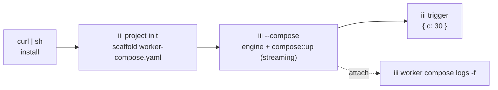
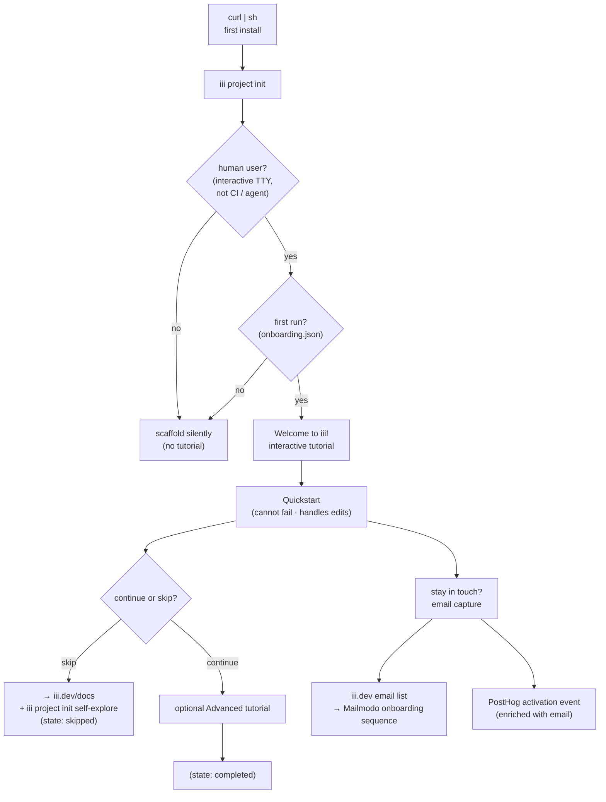

# Lifecycle & Onboarding — the developer journey, day-2 ops, readiness & docs

This is the developer-experience payoff of the whole overhaul: what a developer actually
types and sees, from first install through day-2 operations, error recovery, and CI. It
also pins the two contracts nobody else owns — the **readiness contract** (what "ready"
means for a worker author) and the **testing/CI story** — and closes with the full docs
restructure. The schema lives in [worker-compose.md](worker-compose.md); the PID model in
[process-daemon.md](process-daemon.md); the CLI↔function map in
[cli-and-functions.md](cli-and-functions.md); the config store in
[configuration-and-bootstrap.md](configuration-and-bootstrap.md); phasing in
[migration.md](migration.md).

---

## 1. The thesis: one file, one command, one terminal, zero zombies

Today's hello-world is **install → `iii project init` → `iii` (engine, terminal 1) →
2× `iii worker add` (terminal 2) → `iii trigger`** — roughly five commands across two
terminals, mutating a hand-edited `config.yaml`, with a documented "wait a few seconds or
Function not found" race (`docs/quickstart.mdx:93-96`) and two divergent worker lifecycles
(iii-managed vs run-by-hand).

The target is four commands, one terminal, one declarative file, one supervised process
tree:

```bash
curl -fsSL https://install.iii.dev/iii/main/install.sh | sh   # install
iii project init                                               # scaffold worker-compose.yaml + sample workers
iii --compose                                                  # start the engine + compose up: port + all workers
iii trigger math::add_two_numbers a=10 b=20                    # { "c": 30 }
```

- **One declarative file** — `worker-compose.yaml` (the only file a human edits; `iii.lock`
  is machine-written, beside it). See [worker-compose.md](worker-compose.md).
- **One command** — `iii --compose` starts the engine AND runs `compose up` in one go (the
  tutorial one-liner). The canonical form is `iii worker compose up` (bare `iii` starts the
  engine only); both invoke the identical streaming `compose::up` function. `iii --compose`
  is the single most important onboarding ergonomic. There is no top-level `iii up`.
- **One terminal** — `iii --compose` ensures the daemon + engine are running detached, then
  attaches as a log-streaming client. No mandatory second terminal.
- **Zero zombies by construction** — every worker PID the daemon spawns is a direct child of
  the long-lived `iii-process-daemon`, `wait()`-reaped on exit. Orphans and zombies are
  impossible for daemon-spawned workers. See [process-daemon.md](process-daemon.md).

### Target `iii --compose` terminal output

```
iii --compose · worker-compose.yaml · port 49134

  resolving workers …
  ✓ math-worker      local   ./workers/math-worker
  ✓ caller-worker    local   ./workers/caller-worker   (depends_on: math-worker)

  starting (topological order) …
  ✓ engine           listening   ws://localhost:49134
  ✓ math-worker      ready       3 functions   pid 48120
  ✓ caller-worker    ready       1 function    pid 48121

  up in 2.1s · 2 workers · ^C to stop · iii trigger worker::logs -f to follow
```



---

## 2. `iii project init` — one scaffolder

Today there are **two** scaffolders with two mental models: `iii project init` (creates
`config.yaml`, `engine/src/cli/project/mod.rs`) and `iii worker init` (creates ONE worker,
explicitly *deletes* `config.yaml`, `crates/iii-worker/src/cli/init.rs` cleanup block
~line 285). They share `scaffolder-core` but pull in opposite directions.

**Decision: collapse to a single project-first `iii project init` that emits
`worker-compose.yaml`, never `config.yaml`.**

```bash
iii project init                 # interactive: pick template (bare | quickstart) + name
iii project init quickstart      # non-interactive: the two-worker cross-language demo
iii project init --bare          # just worker-compose.yaml + .gitignore, no sample workers
iii project init --single <lang> # one standalone worker (ts|js|py|rust) — the old `iii worker init`
cd quickstart
```

`iii project init quickstart` produces:

```
quickstart/
├── worker-compose.yaml         # the spine (replaces config.yaml)
├── iii.lock                    # written on first compose up (resolved versions + hashes), beside the compose file
├── .gitignore                  # ignores .iii/ and .env*; iii.lock IS committed
├── workers/
│   ├── math-worker/
│   │   ├── iii.worker.yaml      # per-worker manifest (ships with the worker)
│   │   ├── defaults.yaml        # the worker's default config (the floor compose overrides)
│   │   └── math_worker.py
│   └── caller-worker/
│       ├── iii.worker.yaml
│       ├── defaults.yaml
│       └── src/worker.ts
```

Each sample worker ships a `defaults.yaml` (its default configuration) alongside its
`iii.worker.yaml`; the `worker-compose.yaml` may carry per-worker `config:` overrides over
those defaults (see §6). The scaffolded `worker-compose.yaml` is deliberately minimal:

```yaml
version: "1"
port: 49134

workers:
  math-worker:
    runtime: { workspace: ./workers/math-worker }
  caller-worker:
    runtime: { workspace: ./workers/caller-worker }
    depends_on:
      - name: math-worker
```

What is NOT here vs today's quickstart `config.yaml`: no `iii-worker-manager` entry (the
port is the marquee top-level scalar — see [engine-and-gateway.md](engine-and-gateway.md)),
no `iii-exec` block, and no top-level `configuration:` store block (per-worker config lives
in each worker's `defaults.yaml`, overridden by an optional per-worker `config:` block in
compose). Capability workers (`iii-state`, `iii-http`) are added later (§6), not
front-loaded.

**Scaffolder mechanics.** Reuse `scaffolder-core::TemplateFetcher`
(`crates/scaffolder-core/src/templates/fetcher.rs`); the templates repo `iii-hq/templates`
swaps its shared `config.yaml` file for `worker-compose.yaml` and adds a `defaults.yaml`
per sample worker. `iii project init --single` replaces the old `iii worker init`; because
there is no `config.yaml` to delete, the config.yaml-deletion hack
(`crates/iii-worker/src/cli/init.rs` ~line 285) becomes moot.

**`.gitignore` and secrets.** `iii project init` scaffolds a `.gitignore` that ignores
`.iii/` and `.env*` and **commits** `iii.lock` (one `iii.lock` per compose file, sitting
beside it). Secrets never go in `worker-compose.yaml`; they flow through `env_file`
(gitignored) or `${VAR}` expansion. See [secrets.md](secrets.md).

---

## 3. Onboarding & activation journey

The scaffolder is the *first command*; it is also the first chance to activate a new user
and to make activation **measurable**. This section specs the Excalidraw "Ideal User Flow"
onboarding: an interactive tutorial that runs on first install, an email capture that feeds
a Mailmodo sequence, PostHog activation tracking enriched with that email, and tutorials
that are programmatically testable so the activation claim is real, not aspirational.

### 3.1 First-run interactive tutorial

On **first install + first `iii project init`**, *when the execution context is a human
user* (an interactive TTY, not CI / not a script / not an agent), the CLI launches an
interactive **"Welcome to iii!"** terminal tutorial:

- A step-by-step **Quickstart** that walks the user through the golden path from §1 inside
  the freshly scaffolded project (init → `iii --compose` → `iii trigger`), narrating each
  step and verifying it before advancing.
- Then an **optional Advanced** tutorial (depends_on wiring, adding a capability worker,
  day-2 ops) the user can start or decline.
- **Success is not possible to fail.** The tutorial *handles edits* on the user's behalf
  at each step: if a step's expected state is not met, the tutorial makes the change rather
  than leaving the user stuck. The user always reaches a working end state.

The CLI **tracks skipped/completed state** (persisted under `~/.iii/onboarding.json`, keyed
so it runs at most once). If the user **skips**, the CLI directs them to **iii.dev/docs**
and to `iii project init` for self-exploration, and records `skipped` so it does not nag on
the next invocation.

A non-human context (no TTY, `CI=true`, `--no-tutorial`, or an agent execution context)
never triggers the tutorial; the scaffold proceeds silently.



### 3.2 Email capture, Mailmodo, and PostHog activation

During the tutorial the CLI offers an optional **"stay in touch"** email capture. A
submitted address is added to the **iii.dev email list**, which **kicks off an onboarding
email sequence in Mailmodo** (drip lessons, next steps, what-to-build prompts), so a user
gets follow-up touchpoints even though they never visited iii.dev to sign up.

The same address **enriches PostHog activation tracking**: the first-run, tutorial-step, and
first-successful-`iii trigger` events are attached to a person identified by the captured
email, so activation is attributable end-to-end (install → tutorial → first working trigger
→ later return). This is a deliberate, targeted attempt to *increase* activation, not just
observe it. Email capture is opt-in; declining it skips Mailmodo enrollment but the
anonymous PostHog activation funnel still records.

### 3.3 Tutorials are programmatically testable

The tutorial flow is a **separate concern from the docs prose**: it is code, and it is
**CICD-verifiable**. Each tutorial step has a machine-runnable assertion (the same
`iii trigger … --json | jq -e` primitive from §10), so CI runs the whole Quickstart and
Advanced tutorials against a real engine on every change. A tutorial step that would leave
a user stuck fails the build before it ships.

### 3.4 Why this is worth it (the payoff)

- **Multiple onboarding touchpoints** (terminal tutorial, docs hand-off, and email
  sequence), instead of a single one-shot install.
- **Email flows beyond iii.dev signups**: the CLI capture feeds Mailmodo, reaching users
  who installed via `curl | sh` and never touched the website.
- **Better PostHog tracking**: activation events enriched with a real email make the funnel
  attributable across sessions and channels.
- **Fewer tutorial errors**: "cannot fail / handles edits" plus CI verification removes the
  classic copy-paste-drift breakage.
- **Testable tutorials**: the headline activation claim becomes a measurable, regression-
  gated property of the product, not a hope.

---

## 4. `iii --compose` / `iii worker compose up` semantics (reconciled with canon)

`iii --compose` (and the canonical `iii worker compose up`) runs in the **foreground by
default**, but it is **not** the process parent. This is the precise layering (resolves the
F-vs-C tension flagged in critique A7):

| Step | Who | What |
|---|---|---|
| 1 | CLI | Ensure `iii-process-daemon` + engine are running, **detached and long-lived**. Spawn them if absent. (`iii --compose` also starts the engine; `iii worker compose up` assumes an engine, started by bare `iii`.) |
| 2 | CLI → worker-ops | Invoke streaming `compose::up`; render `ComposeEvent` progress. |
| 3 | worker-ops | Topo-sort the graph, resolve, call `process::start` per *local* node, gate each on readiness via trigger subscription (`crates/iii-worker/src/cli/local_worker.rs:588`). |
| 4 | CLI | **Attach as a log-streaming client** and install a **SIGINT handler that invokes `compose::down`**. |

The behavioral contract that follows:

- **Ctrl-C (SIGINT)** = clean teardown. The CLI *actively calls* `compose::down`; teardown
  is an explicit action, not a side effect of the CLI exiting. This preserves
  docker-compose muscle memory.
- **`kill -9` of the CLI** = workers **keep running**. The local daemon owns the workers it
  spawned; the CLI was only a viewer. `iii worker compose down` (or a later
  `iii worker compose up`) reconciles.
- **`iii worker compose up -d` / `--detach`** = same as foreground minus the attach and
  minus the SIGINT→down handler. Frees the terminal; `iii worker compose down` stops the
  stack.

The CLI is a **viewer**; the local runner's supervisor owns the local PIDs. That supervisor
is the **`iii-process-daemon`**, but it is the LOCAL runner's supervisor, **one option among
docker / systemd / bash**, not the universal owner of every PID. The **engine manages
nothing**: it never spawns, never parents, never supervises a worker. Because the daemon is
always detached and survives engine hot-reload (it is a separate long-lived process; see
[process-daemon.md](process-daemon.md)), the foreground CLI never becomes the supervisor.
The drain/restart protocol it relies on lives in
[engine-and-gateway.md](engine-and-gateway.md).

**`depends_on` kills the "Function not found" race.** `compose::up` does not start
`caller-worker` until `math-worker` reports **ready** (process up + WS-connected +
functions registered; see the readiness contract in §9). Readiness gates by **subscribing
to the engine's worker-available trigger**, not polling. The default `depends_on` condition
is `ready`, strictly stronger than Docker's `started`. Validation (missing refs, cycles)
happens up-front during graph build; nothing starts if the graph is invalid.

---

## 5. Hot-reload journey

```bash
# edit workers/math-worker/math_worker.py, save
```

What the dev sees in the `iii --compose` / `iii worker compose logs -f` stream:

```
  ~ math-worker      source changed   restarting …
  ✓ math-worker      ready            3 functions   pid 48140
  ~ caller-worker    dependency restarted   (no restart needed)
```

Semantics:

- Local `workspace:` workers are watched (the `__watch-source` sidecar,
  `crates/iii-worker/src/cli/local_worker.rs:1137` — today detached, now a daemon-owned
  child). On change, setup/install are skipped if the `.iii-prepared` marker is unchanged
  (`local_worker.rs:182-280`); only `start` is re-exec'd.
- **The daemon owns the restart**, so the old PID is `wait()`-reaped *before* the new one
  starts — no leak, no zombie. The drain protocol (let in-flight invocations finish before
  swapping the connection) is specified in [engine-and-gateway.md](engine-and-gateway.md).
- **Dependents are NOT auto-restarted** unless the worker's *interface* changed (the set of
  registered functions differs). Keep it cheap: a behavioral edit to `math-worker` that
  keeps the same functions does not bounce `caller-worker`.

---

## 6. The real-app journey: remote packages, two copies, wiring

Everything past hello-world is one edit to `worker-compose.yaml` + `iii worker compose up`,
or the imperative equivalent.

### 6.1 Add a capability worker — declarative by default

```bash
iii worker add iii-state         # appends to worker-compose.yaml + iii.lock
iii worker add iii-http
iii worker add observability     # remote: workers.iii.dev/observability:latest
```

`iii worker add <name>` resolves `<name>` to `package: workers.iii.dev/<name>:latest`,
writes the resolved concrete version + sha256 into `iii.lock` (keyed by
`(package, version)` so two divergent copies are representable), and adds a minimal entry
to `worker-compose.yaml`:

```yaml
version: "1"
port: 49134
workers:
  math-worker:    { runtime: { workspace: ./workers/math-worker } }
  caller-worker:  { runtime: { workspace: ./workers/caller-worker }, depends_on: [ { name: math-worker } ] }
  state:          { runtime: { package: workers.iii.dev/iii-state:latest } }
  http:           { runtime: { package: workers.iii.dev/iii-http:latest } }
```

**Decision (BREAKING vs today): `add` is declarative-only and does NOT auto-start.** Today
`add` mutates `config.yaml` AND auto-starts a PID (`docs/quickstart.mdx:36`). In the new
model `add` only edits the file + lock; `iii worker compose up` (or `iii worker start <id>`)
reconciles running state. There is exactly ONE source of truth (worker-compose.yaml +
iii.lock, beside it) and ONE way to make reality match it. For convenience,
`iii worker add --up` reconciles immediately. This is gated behind compose-mode during
migration (see [migration.md](migration.md)); the `AddOptions.source` → `sources: Vec`
change is a net-new breaking function-schema change, versioned.

### 6.2 Two copies of the same package (distinct ids)

```yaml
workers:
  http-public:
    runtime: { package: workers.iii.dev/iii-http:latest }
    environment: { LISTEN_PORT: "3111" }
  http-internal:
    runtime: { package: workers.iii.dev/iii-http:latest }
    environment: { LISTEN_PORT: "3211" }
```

The id (`http-public`) is the stable name everywhere — logs, `ps`, `exec`, and the
configuration entry it registers at boot. The package is identical; the daemon supervises
two children, distinguished by id (not by config files). Each worker ships a `defaults.yaml`
and each compose entry may override it with its own `config:` block under its own id.
Duplicate semantics are owned by [worker-compose.md](worker-compose.md).

### 6.3 Wiring depends_on + env — the two resolution rules

```yaml
workers:
  caller-worker:
    runtime: { workspace: ./workers/caller-worker }
    depends_on:
      - name: math-worker                  # any worker of this type
      - id: state                          # one specific instance
    environment:
      LOG_LEVEL: debug                     # overrides iii.worker.yaml env
    env_file:
      - .env                               # lower precedence
      - .env.local                         # LATER file wins
    config:
      retries: 5                           # overrides caller-worker's defaults.yaml
```

`depends_on` entries take the `- name: <type>` form (depend on any worker of that type) or
the `- id: <instance-id>` form (depend on one specific instance); a bare string short form
`- state` means `name: state`. Readiness gates by **subscribing to the engine's
worker-available trigger** (the deps may be local or **remote**), not by polling. A worker
gates only on the deps it declares (targeted, not blanket).

A developer must internalize exactly two rules (kept deliberately small):

1. **Override:** any `worker-compose.yaml` field overrides the worker's shipped
   `iii.worker.yaml` and `defaults.yaml` (deep-merge maps like `environment`/`scripts`/
   `config` by key; replace scalars and lists like `depends_on`/`env_file`). Configuration
   **is now a merged field**: effective config = `defaults.yaml` ◁ compose base `config:` ◁
   target-overlay `config:` (the optional `configuration` worker reads that effective value
   and writes runtime changes back into the active compose file, never `defaults.yaml`).
2. **Env precedence (later-wins):** the full ladder, highest → lowest, is
   **host process env > inline `environment:` > `env_file[n]` > … > `env_file[0]`**. Among
   files, the **last-listed file wins**. (This supersedes the mission's "lowest in list
   wins" phrasing; see [worker-compose.md](worker-compose.md).)

### 6.4 Bring it up

`iii worker compose up` (or `iii --compose`) is the same one command. Output now shows the
dependency-ordered bring-up of `state` → `http` → `math-worker` → `caller-worker`, each
gated on readiness. The developer never thinks about the WS port, pidfiles, or install
timing.

---

## 7. Day-2 operations

Every command is a thin wrapper over a `worker::*` / `process::*` / `compose::*` /
`configuration::*` function (see [cli-and-functions.md](cli-and-functions.md)) over the
same WS transport `iii trigger` uses.

```bash
# Status — scriptable data dumps (NEW info + ps, not the live TUI)
iii worker compose status                # process table: id, source, state, pid, uptime, restarts, fns
iii worker info caller-worker            # static + resolved: source, version, deps, env, effective config
iii worker status                        # compose-wide health rollup (one-shot)
iii worker status caller-worker --watch  # opt-in live TUI

# Logs
iii worker compose logs                  # all workers, interleaved, color-keyed by id
iii worker compose logs -f               # follow
iii worker logs caller-worker --since 5m # one worker, time-bounded

# Lifecycle (single worker, no full down/up)
iii worker restart caller-worker
iii worker stop  state
iii worker start state

# Exec into a worker (host process or its sandbox/VM)
iii worker exec caller-worker -- sh
iii worker exec caller-worker -- npm run migrate

# Config (the OPTIONAL configuration worker writes back into the active compose file)
iii worker config get caller-worker                       # show resolved config blob (secrets redacted)
iii worker config set caller-worker retries=5             # live set; writes back into worker-compose.yaml
iii worker config edit caller-worker                      # open $EDITOR, write back into the compose file
```

`iii worker compose status` target output:

```
ID              SOURCE   STATE    PID     UPTIME   RESTARTS   FNS
math-worker     local    ready    48120   4m12s    0          3
caller-worker   local    ready    48121   4m10s    0          1
state           remote   ready    48118   4m20s    0          5
http-public     remote   ready    48130   4m20s    1          2
```

Day-2 design decisions:

- **`info` and `compose status` are data dumps** — non-interactive, scriptable,
  `--json`-able. `status` keeps the live TUI but behind `--watch`. This fixes the "status is
  a TUI not a data dump" gap.
- **One-shot vs live:** `compose status`/`info` are point-in-time; `status --watch` is the
  streaming surface the [TUI](migration.md) (`tuiii`) consumes.
- **`iii worker config`** is per-worker get/set/edit backed by
  `configuration::{get,set,list,schema}`. The `configuration` worker is **OPTIONAL** (iii
  runs with zero workers, including this one). When present, it is a read/update layer over
  the **active `worker-compose.yaml`**: it resolves the effective value (`defaults.yaml` ◁
  compose), validates `set` against the worker's JSON schema, and **writes the change back
  into whichever compose file the worker was started from** (never `defaults.yaml`; it errors
  if no compose file is found). Without the configuration worker, config is static
  (`defaults.yaml` ◁ compose, resolved at start). Restart-tier fields warn "requires
  restart". Secrets are redacted as `***` unless `--reveal` is passed (see
  [secrets.md](secrets.md)).
- **`iii worker sandbox …`** still works for explicit sandbox/microVM ops, backed by the
  unchanged `sandbox::*` functions; the direction is to retire the bespoke command in favor
  of `iii trigger` once `iii trigger` gains async/streaming + upload/download (see
  [cli-and-functions.md](cli-and-functions.md)).

---

## 8. Error & recovery DX

Daemon ownership exists to make failure *legible*. Concrete messages:

### 8.1 Crashed worker (auto-restart with backoff)

```
  ✗ caller-worker    exited (code 1)   restarting (1/5) …
  ✓ caller-worker    ready             1 function   pid 48155

  caller-worker crashed once. Last 10 log lines:
    TypeError: cannot read property 'add' of undefined
    …
  → iii worker logs caller-worker --since 1m   for the full trace
```

The daemon is the direct parent, so it observes the exit immediately (no `kill(pid,0)`
polling), records it in the authoritative process table (the `RESTARTS` column), and
applies bounded exponential backoff. After N failures it stops and marks the worker
`failed` rather than thrashing. See [process-daemon.md](process-daemon.md).

### 8.2 Zombies — impossible by construction (no recovery UX)

There is no "zombie recovery" UX because there are no zombies for daemon-spawned workers.
The structural root cause (detach with `setsid()` + return immediately + pidfile handoff)
is removed: every worker the daemon spawns is a tracked child of the long-lived daemon,
`wait()`-reaped on exit. (Workers started by docker / systemd / by hand are supervised by
their own managers and appear to iii as observe-only connections.) The only related UX is
the **startup orphan sweep**: if the daemon itself was `kill -9`'d, the next
`iii worker compose up` re-adopts surviving children by `instance_token` (or kills them) and
prints:

```
  ! found 2 orphaned worker processes from a previous run — reclaimed
  ✓ math-worker      ready   (reattached pid 48120)
  ✓ caller-worker    ready   (reattached pid 48121)
```

### 8.3 Missing dependency (did-you-mean)

```
  ✗ compose error: worker "caller-worker" depends_on name "mathh-worker" which is not declared

    declared workers: math-worker, caller-worker, state
    did you mean "math-worker"?

  → fix depends_on in worker-compose.yaml
```

Validated up-front during graph build. Nothing starts on an invalid graph — fail fast, no
half-up state.

### 8.4 depends_on cycle

```
  ✗ compose error: dependency cycle detected
    caller-worker → state → caller-worker
  → break the cycle in worker-compose.yaml
```

### 8.5 Port conflict

```
  ✗ cannot bind ws://localhost:49134 — address already in use

    another iii is likely running here. Options:
      iii worker compose down       stop the existing stack
      iii worker compose status     see what's running
      edit worker-compose.yaml       change top-level `port:`
```

The port is one top-level field, so the error points at exactly one place. A *worker's*
listener port conflict (e.g. http `3111`) names the worker id and its `environment` source
(or its `config:` block).

### 8.6 Install / version failure (lock fallback)

```
  ✗ state   failed to resolve workers.iii.dev/iii-state:latest (network)
            using last-locked version from iii.lock: iii-state@1.4.2
  ✓ state   ready (offline, locked)
```

The committed `iii.lock` (beside the compose file) lets `iii worker compose up` proceed
offline with the last resolved version. `iii worker compose up --frozen` (CI) refuses any
drift from the lock (§10).

---

## 9. The readiness contract (define it — nobody else did)

`depends_on` is sold as the fix for the "Function not found" race, so "ready" must be
**defined for a worker author**, not just asserted. Readiness is a three-level contract;
the author opts up. Gating is by **trigger subscription**, not polling: `compose::up`
subscribes to the engine's **`worker_available`** trigger (and the per-worker ready signal)
and releases a dependent when its declared deps reach the required level. Because the gate
is the engine's availability report, a dep may be **local or remote**; a `depends_on` on a
worker running on another host resolves through the same `worker_available` trigger.

| Level | Name | Met when | Detected by |
|---|---|---|---|
| **L0** | spawned | process has a PID | daemon process table |
| **L1** | connected | WS-connected **and** functions registered | engine registry + `worker_available` trigger subscription (`local_worker.rs:588`) |
| **L2** | healthy | a worker-declared `healthcheck:` passes | daemon poll of the declared probe |

**v1 default = L1.** `depends_on: [ { name: x } ]` waits until a worker of type `x` reaches
L1; `- id: state-myWorker` waits on one specific instance. An opt-in `condition: started`
(L0) and a `healthcheck:` block (L2) are the escape hatches.

```yaml
workers:
  model-server:
    runtime: { package: workers.iii.dev/model-server:latest }
    healthcheck:
      function: health::check      # a function the worker exposes; returns ok/not-ok
      interval: 5s
      timeout: 2s
      retries: 10
      start_period: 30s            # grace before failures count (slow warm-up)
  api:
    depends_on:
      - name: model-server         # by type
        condition: healthy         # wait for L2, not just L1
```

A remote dependency reads the same way; the engine reports the remote worker as available
via `worker_available` and the gate releases:

```yaml
workers:
  api:
    depends_on:
      - id: state-remote           # a specific instance, possibly on another host
```

**How an author declares readiness.** Two supported paths:

1. **Stay not-ready (recommended for slow warm-up).** A worker that needs to load a model
   or open a pool simply does not register its functions until warm. L1 then naturally
   reflects functional readiness — no extra surface.
2. **Declare an L2 `healthcheck:`** that calls a worker-exposed function (e.g.
   `health::check`) or runs a command. Use this when the worker must register functions
   early (to be discoverable) but is not yet serving traffic.

The `healthcheck:` block schema is owned by [worker-compose.md](worker-compose.md); the
daemon poll mechanics by [process-daemon.md](process-daemon.md).

**Healthcheck FAIL of an already-running worker.** Decision: a worker that was healthy and
then fails its healthcheck `retries` times in a row is **marked `unhealthy` but left
running** (state shows `unhealthy` in `ps`/`status`; it is NOT restarted automatically).
Rationale: an unhealthy-but-alive worker may be mid-recovery (reconnecting to a DB), and a
restart loop is more disruptive than a visible `unhealthy` flag. An explicit
`healthcheck.on_fail: restart` opts into restart-on-unhealthy for workers that prefer it.
Process *exit* (a real crash) is always handled by the backoff/restart policy in §8.1 —
this rule is only about alive-but-unhealthy.

### Open questions

- **L2 probe transport.** Two options: (a) a worker-exposed `health::check` function the
  daemon calls over WS, or (b) an in-VM/host command. Recommended default: **(a) for
  connected workers** (uniform with the function bus, no shell needed), **(b) only inside
  sandboxes**. Lead author to confirm whether `health::check` becomes a reserved function
  name.
- **`unhealthy` and `depends_on`.** If `api` depends on `model-server: { condition: healthy }`
  and `model-server` later goes `unhealthy`, do we stop routing to it? Recommended: surface
  it, do not auto-stop dependents (matches the "mark, don't cascade" stance above).

---

## 10. Testing / CI for worker authors

DX includes the test loop, which no prior design covered. The primitives already exist;
this assembles them into a recipe. (The interactive tutorials in §3 are CI-verified through
this same `trigger --json` assertion primitive.)

### 10.1 Partial bring-up

```bash
iii worker compose up --only caller-worker  # bring up caller-worker + its depends_on closure
iii worker compose up math-worker state     # explicit subset (compose::up [W…])
```

`--only <id>` resolves the `depends_on` closure so the worker under test gets its real
dependencies and nothing else.

### 10.2 Ephemeral mode (isolation from a running dev stack)

```bash
iii worker compose up --ephemeral --only caller-worker
```

`--ephemeral` uses a **temp compose scope + a random free `port`** so a test run never
collides with a developer's live stack on `49134`. On teardown the temp scope is discarded.
This is the safe default for CI and for `git`-hook test runs.

### 10.3 Assertions

`iii trigger fn k=v --json` is the assertion primitive — it prints the raw function result
as JSON to stdout, so a test asserts on it directly:

```bash
result=$(iii trigger math::add_two_numbers a=10 b=20 --json)
echo "$result" | jq -e '.c == 30'
```

### 10.4 Lock-drift gate

```bash
iii worker compose up --frozen     # CI: refuse to run if resolution would differ from iii.lock
```

`--frozen` fails the build if `worker-compose.yaml` would resolve to anything not already
pinned in the committed `iii.lock` (beside the compose file) — the reproducible-build gate.

### 10.5 A thin `iii test` recipe

A minimal `package.json` / `Makefile` target, not new machinery:

```bash
# scripts/test.sh
set -euo pipefail
iii worker compose up --ephemeral --frozen --only caller-worker
trap 'iii worker compose down --ephemeral' EXIT
iii trigger math::add_two_numbers a=10 b=20 --json | jq -e '.c == 30'
```

**Open question.** Whether to ship this as a first-class `iii test` subcommand (auto-wires
`--ephemeral` + `trap down`) or leave it as a documented recipe. Recommended: document the
recipe in v1; promote to `iii test` only if authors ask.

---

## 11. Before / after

| Dimension | Today (friction) | Target |
|---|---|---|
| **Files to understand** | `config.yaml` (hand-edited + command-mutated) + `iii.lock` + per-worker `iii.worker.yaml`; SDK example configs 80–126 lines | One `worker-compose.yaml` (port + workers map) + auto-managed `iii.lock` beside it; per-worker config in `defaults.yaml` overridden by compose `config:` |
| **Commands to first call** | install → `project init` → `iii` (T1) → 2× `worker add` (T2) → `trigger` ≈ 5 cmds / 2 terminals | install → `iii project init` → `iii --compose` → `iii trigger` = 4 cmds / 1 terminal |
| **Terminals** | ≥2 (foreground engine + ops tab) | 1 (`iii --compose` foreground, or `-d`) |
| **Lifecycle** | foreground engine; no up/down; `add` auto-starts PIDs | `iii worker compose up`/`down` (`iii --compose` one-liner); declarative reconcile; `add` edits file only |
| **Onboarding** | docs only; activation unmeasured | first-run interactive tutorial (cannot fail) + email capture → Mailmodo + PostHog activation; testable in CI |
| **Startup race** | "wait a few seconds or Function not found" | `depends_on` + L1 readiness via `worker_available` trigger subscription; no race |
| **Process safety** | zombies/orphans; pidfile + `ps`-scan; two divergent lifecycles | the local daemon is direct parent of the workers it spawns; reaped on exit; zombies impossible for those; docker/systemd/remote workers observe-only |
| **Ports** | WS port hidden in `iii-worker-manager`; data ports buried in per-worker config | top-level `port:`; worker ports in that worker's `environment` (or its `config:` block), surfaced by `iii worker compose status`/`info` |
| **CLI verb surface** | 30+ leaf commands | consolidated `add/update/remove/clear/list/info/start/stop/restart/logs/status/exec/config` + `compose {up,down,restart,status,validate}` |
| **Scaffolding** | `project init` (makes config.yaml) vs `worker init` (deletes config.yaml) | one `iii project init` (emits worker-compose.yaml + per-worker defaults.yaml); `--single` for one worker |
| **Lockfile on day 1** | sync/verify/drift in the quickstart | `iii.lock` is invisible plumbing (one per compose file); surfaces only in CI (`--frozen`) and `info` |
| **Arbitrary processes** | `iii-exec` buried in config.yaml | `process::start{spec, watch}` on the daemon; declared in compose |
| **Config is…** | hand-edited YAML blocks per worker | a merged field: `defaults.yaml` ◁ compose `config:` ◁ target overlay; the OPTIONAL `configuration` worker reads/updates the active compose file |
| **Readiness** | undefined; "wait a few seconds" | L0/L1/L2 contract; default L1; gated by trigger subscription; `healthcheck:` escape hatch |
| **Multi-host** | out of scope | hub model: one shared engine; remote `depends_on` via `worker_available`; lifecycle local-per-runner |
| **Testing/CI** | undocumented | `compose up --only` + `--ephemeral` + `trigger --json` + `--frozen` |
| **CLI ↔ function parity** | partial: 7 verbs function-backed | every verb is a `worker::*`/`process::*`/`compose::*` function; CLI is a thin wrapper |

---

## 12. Docs restructure

Grouped by action. Paths are repo-relative under `/Users/sergio/Documents/workspaces/iii/iii/`.

### Rewrite (config.yaml → worker-compose.yaml + compose lifecycle)

- `docs/quickstart.mdx` — replace steps 2–7 (`iii --config config.yaml`, every
  `iii worker add`, the 2-terminal "keep this open") with `iii project init` →
  `iii --compose` → `iii trigger`. (Lines 52–236.)
- `docs/using-iii/engine.mdx` — gut the config.yaml sections ("Engine configuration",
  "Configuration file structure", "Env var expansion", "Default configuration",
  lines 15–83); replace with worker-compose.yaml + the top-level `port`.
- `docs/using-iii/workers.mdx` — rewrite "Managing workers" / "Adding a worker"
  (config.yaml write at line 62), demote the lockfile section (153–186) to "Reproducible
  installs / CI", and retarget start/stop/status/logs/exec verbs (80–106) to the
  consolidated CLI (`iii worker compose …`).
- `docs/using-iii/cli.mdx` — replace the subcommand table (36–46) with the consolidated
  verb set + `iii worker compose …` (canonical) and `iii --compose` (one-liner); document
  CLI↔function parity. No top-level `iii up`/`iii down`.
- `docs/creating-workers/workers.mdx` (433–461) & `docs/creating-workers/worker-manifest.mdx`
  (8–12) — switch the "engine reads manifest from config.yaml" narrative to the
  worker-compose override-precedence model (incl. the worker's `defaults.yaml`).
- `docs/understanding-iii/engine.mdx`, `docs/understanding-iii/index.mdx` — adjust the
  worked example to the compose model.
- `docs/using-iii/deployment.mdx` — the generate-Docker-assets flow assumes config.yaml;
  retarget to worker-compose.yaml + `iii.lock`.
- `docs/install.mdx` — resolve the binary-download TODO (line 8); drop the
  "auto-downloads iii-worker" wrinkle once single-binary lands.

### Add (new pages)

- `docs/using-iii/worker-compose.mdx` — the new spine page: file schema (version, port,
  gateway, workers; per-worker `defaults.yaml` + compose `config:` overrides; runtime
  workspace/package, scripts, depends_on `name:`/`id:`, environment, env_file, healthcheck;
  targets), override semantics, env precedence, duplicate-id. Mirrors
  [worker-compose.md](worker-compose.md).
- `docs/using-iii/lifecycle-and-processes.mdx` — `iii worker compose up`/`down`, `iii
  --compose`, foreground vs `-d`, hot-reload, the local daemon ownership model
  (one runner option among docker/systemd/bash; the engine manages nothing), crash/backoff,
  orphan sweep, the readiness contract, and "why no zombies". Mirrors this doc +
  [process-daemon.md](process-daemon.md).
- `docs/using-iii/onboarding.mdx` — the first-run **interactive tutorial** (Welcome to iii!,
  Quickstart + optional Advanced, cannot-fail/handles-edits, skip → iii.dev/docs +
  self-exploration). Mirrors §3.
- `docs/using-iii/activation.mdx` — email capture → iii.dev list → Mailmodo sequence; PostHog
  activation tracking enriched with the email; tutorials as CI-verifiable. Mirrors §3.2–§3.4.
- `docs/using-iii/configuration.mdx` — per-worker `defaults.yaml` + compose `config:`
  overrides; the OPTIONAL `configuration` worker reading/updating the active compose file;
  `iii worker config get/set/edit`; LIVE vs restart-tier fields; secret redaction. Mirrors
  [configuration-and-bootstrap.md](configuration-and-bootstrap.md) + [secrets.md](secrets.md).
- `docs/using-iii/testing.mdx` — the §10 recipe: `compose up --only`, `--ephemeral`,
  `trigger --json`, `--frozen`.
- `docs/reference/cli.mdx` and `docs/reference/functions.mdx` — generated parity tables:
  each CLI verb and its backing `worker::*`/`process::*`/`compose::*` function.

### Archive (remove / supersede)

- `docs/0-11-0/workers/iii-exec.mdx` — folded into the process-daemon page.
- `docs/0-11-0/workers/iii-worker-manager.mdx` — folded into compose `port` + the engine
  gateway.
- `docs/0-11-0/workers/worker-management-triggers.mdx`,
  `docs/0-11-0/how-to/create-ephemeral-worker.mdx`,
  `docs/0-10-0/how-to/create-ephemeral-worker.mdx`.
- `docs/tutorials/linkly/frontend.mdx` (+ `next/`, `0-18-0/` copies) — port off `iii-exec`.

### Port (examples & templates)

- `sdk/packages/node/iii-example/config.yaml`,
  `sdk/packages/python/iii-example/config.yaml` (incl. their `iii-exec` blocks) →
  `worker-compose.yaml` (+ a per-worker `defaults.yaml`).
- Templates repo `iii-hq/templates`: swap the shared `config.yaml` for `worker-compose.yaml`
  (and add a per-worker `defaults.yaml`) in both `bare` and `quickstart`; delete the
  `iii worker init` config.yaml-cleanup hack (`crates/iii-worker/src/cli/init.rs` ~line 285)
  — moot.
