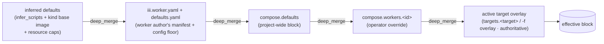

# worker-compose.yaml — schema & semantics

`worker-compose.yaml` is the human-authored boot file for an iii project (one per target, e.g.
`worker-compose.dev.yaml` / `worker-compose.prod.yaml`). It carries the irreducible bootstrap floor (the
WS gateway `port`, plus the optional listener knobs) and the worker list + topology + per-worker config
overrides, and is the *only* file a person edits. This document is the reference for its schema, its merge
semantics over each worker's `iii.worker.yaml` (runtime/scripts/environment/topology) and the worker's
shipped `defaults.yaml` (per-worker `config:`), its relationship to the machine-written `iii.lock`, and
its validation/error behavior. Every claim about current behavior is grounded in cited code (repo-relative
paths).

For *who consumes* this file at runtime, see [engine-and-gateway.md](engine-and-gateway.md) (port binding +
registration protocol), [cli-and-functions.md](cli-and-functions.md) (the `compose::*` / `worker::*`
functions that parse and orchestrate it), [configuration-and-bootstrap.md](configuration-and-bootstrap.md)
(the `defaults.yaml` floor + compose `config:` override chain, `config-worker:` resolution, and the
optional `configuration` worker that reads/updates the active compose file), [process-daemon.md](process-daemon.md)
(the PID parent that `compose::up` drives), and [migration.md](migration.md) (the config.yaml → compose
cutover).

---

## 1. Design principles

These decisions drive every field in the schema.

1. **One file is the boot egg.** The irreducible *bootstrap floor* is small: just the WS `port` (plus the
   optional `gateway:` listener knobs), because that is the only fact that must be static before any worker
   can connect. There is no configuration-store location to bootstrap (config now lives in the compose file
   itself, see #4). `worker-compose.yaml` *is* that egg. It replaces both `config.yaml`'s `workers:` list
   and the old `iii-worker-manager.config.port` indirection (`engine/src/workers/worker/mod.rs:52-66`
   `WorkerManagerConfig{port,host,middleware_function_id,rbac}`). The WS listener is now baked into the
   engine as the internal **worker-gateway**; it is no longer a worker (see
   [engine-and-gateway.md](engine-and-gateway.md)).

2. **Compose = desired state; `iii.lock` = resolved state.** This is the package.json/lockfile split, and
   it is already the codebase's grain. Compose is the only file a human edits; `iii.lock` is machine-written,
   carries hashes + pinned digests, and is never hand-edited. We do **not** fold one into the other (§10).

3. **Compose overrides the worker's manifest, field by field, never the reverse.** A worker ships an
   `iii.worker.yaml` declaring sensible defaults; the operator's `worker-compose.yaml` is authoritative and
   overrides it. The merge reuses the existing `deep_merge` primitive (`crates/iii-worker/src/cli/config_file.rs:388-405`:
   objects merge recursively, everything else replaces) so the behavior is identical to today's config merge (§4).

4. **Per-worker config lives in the compose file, over the worker's `defaults.yaml` floor.** A worker ships
   its own **`defaults.yaml`** holding its default configuration values. The user authors a per-worker
   **`config:`** block in `worker-compose.<target>.yaml` that overrides what it needs for that target;
   anything not overridden falls back to `defaults.yaml`. Effective config per worker is
   `defaults.yaml` ◁ compose base `config:` ◁ active-target `config:` (§4). Config IS a merged field. The
   **`configuration`** worker is **OPTIONAL** (iii runs with zero workers, including this one): when present
   it is a read/update layer over the **active `worker-compose.yaml`**, resolving the effective value and
   writing runtime changes **back into the compose file the worker was started from**; it NEVER edits
   `defaults.yaml`, and it errors when no `worker-compose.yaml` is found. Without it, config is static
   (`defaults.yaml` ◁ compose, resolved at start). The historical inline-config sprawl in `config.yaml`
   (`crates/iii-worker/src/cli/local_worker.rs:519-528`) is carried into the compose `config:` block by
   migration, not discarded (see [configuration-and-bootstrap.md](configuration-and-bootstrap.md)).

5. **Typed, strict schema with `deny_unknown_fields`.** Unlike `iii.worker.yaml` (which has *no* serde
   struct and must stay permissive for forward-compat, every consumer field-picking an untyped
   `serde_yaml::Value`), `worker-compose.yaml` is new, greenfield, and human-authored, so it gets a typed
   serde struct with `#[serde(deny_unknown_fields)]` (within the current major; see the versioning policy
   in §11) to catch typos early and give good errors (§12, §13). The per-worker `config:` block is the one
   open-ended map (untyped `serde_yaml::Value`), because the schema belongs to the worker, not to compose.

---

## 2. The annotated canonical `worker-compose.yaml`

```yaml
# worker-compose.yaml — the human-authored boot file for an iii project (one per target).
# Replaces config.yaml's `workers:` list AND the iii-worker-manager port indirection.

# ── Format marker. REQUIRED. Semver; minor adds optional fields, major = breaking (see §11).
version: "1"

# ── WS gateway port the engine opens for SDK workers to connect to.
#    THE one marquee top-level scalar, and the ONLY irreducible bootstrap fact: it must be
#    static because it is the port every worker connects over.
#    Replaces WorkerManagerConfig.port (engine/src/workers/worker/mod.rs:54; DEFAULT_PORT=49134).
port: 49134

# ── OPTIONAL: WS-listener (worker-gateway) knobs. All bootstrap-tier alongside `port`.
gateway:
  host: "0.0.0.0"                     # bind host (WorkerManagerConfig.host, worker/mod.rs:58)
  rbac:                               # WorkerManagerConfig.rbac (worker/mod.rs:60, rbac_config::RbacConfig)
    auth_function_id: security::authorize
  middleware_function_id: null        # WorkerManagerConfig.middleware_function_id (worker/mod.rs:59)

# ── OPTIONAL: project-wide worker defaults applied to EVERY worker BEFORE its iii.worker.yaml
#    and BEFORE its per-worker block. Lowest compose-tier precedence (§4).
defaults:
  environment:
    LOG_LEVEL: info
  scripts:
    install: ""                       # opt out of install everywhere unless a worker overrides

# ── The workers this engine manages. Map of <instance-id> -> worker block. REQUIRED.
#    The <id> is the INSTANCE id (not necessarily the package name); this is what makes
#    "two copies of the same worker" trivial (Example 5).
workers:

  # Local source worker (developer's own code in a sibling dir).
  math:
    runtime:
      workspace: ./workers/math-worker   # local path -> source, not an artifact
    scripts:
      start: npm run dev                 # overrides the manifest's start
    environment:
      MATH_PRECISION: "8"
    env_file:
      - .env                             # lower priority
      - .env.local                       # LATER files WIN (§5); .env.local beats .env
    config:                              # per-worker config; overrides the worker's defaults.yaml (§4)
      precision: 8                       # inline value wins over defaults.yaml's precision
      # config.path is OPTIONAL: point the entry at an external source instead of inlining.
      # Default addressing when omitted is config-worker:<workerid> (here config-worker:math).
      #   path: config-worker:math       # the configuration worker resolves this against the active compose
      #   path: ./math.config.yaml       # OR a local file, resolved relative to THIS compose file (§12)
    depends_on:
      - name: state                      # gate on ANY instance of the `state` worker type, by readiness (§7)

  # Remote registry worker, pinned to a floating tag.
  state:
    runtime:
      package: workers.iii.dev/iii-state:latest

  # Remote worker pinned to an exact version, run inside a custom base image (sandboxed).
  scraper:
    runtime:
      package: workers.iii.dev/scraper:1.4.2
      base_image: ghcr.io/acme/scraper-base:1.2.3   # OCI rootfs for the sandbox VM
      cpus: 4
      memory: 4096
      egress: true                       # VM internet egress on (NOT inter-worker networking, §6)
    depends_on:
      - id: state                        # gate on ONE specific instance, by its instance id (§7)
    healthcheck:                         # optional L2 readiness escape hatch (§8)
      function_id: scraper::health
      interval: 5s
      timeout: 2s
      retries: 3

# ── OPTIONAL: per-target overrides (package.json-like). A target may change ANYTHING about how a
#    worker starts (scripts, runtime, env, config). Equivalent to a separate worker-compose.<target>.yaml
#    overlay (§14). The active target's overlay is the highest-precedence layer in the merge chain (§4).
targets:
  development:
    workers:
      math:
        config: { precision: 8 }
  production:
    workers:
      math:
        scripts: { start: npm run start }   # build artifact instead of dev server
        config: { precision: 16 }
      scraper:
        runtime: { cpus: 4, memory: 4096 }
```

---

## 3. Formal field tables

### 3.1 Top-level keys

| Key | Type | Req | Default | Bootstrap-tier? | Meaning / source |
|---|---|---|---|---|---|
| `version` | string | **yes** | — | n/a | Schema format marker. Semver. Reject unknown majors with a clear error (§11). |
| `port` | u16 | no | `49134` | **yes** | WS gateway port. Replaces `WorkerManagerConfig.port` (`worker/mod.rs:54`). The engine binds it natively at boot (`engine-and-gateway.md`). |
| `gateway` | object | no | none | **yes** | WS-listener knobs: `host`, `rbac`, `middleware_function_id`. Maps to `WorkerManagerConfig` (`worker/mod.rs:52-66`). |
| `gateway.host` | string | no | `"0.0.0.0"` | **yes** | WS bind host (`worker/mod.rs:58`). |
| `gateway.rbac` | object | no | none | **yes** | WS-listener RBAC (`worker/mod.rs:60`, `rbac_config::RbacConfig`). |
| `gateway.middleware_function_id` | string | no | none | **yes** | Per-invocation middleware fn (`worker/mod.rs:59`). |
| `defaults` | worker-block (partial) | no | none | n/a | Project-wide worker defaults, lowest compose-tier precedence (§4). |
| `workers` | map<id, worker-block> | **yes** | — | n/a | The set this engine manages. `id` is `[a-z0-9_-]{1,64}` (same rule as configuration ids). |
| `targets` | map<target-name, partial-compose> | no | none | n/a | Per-target overlays (development/production/staging/testing/next). Each value is a partial `worker-compose.yaml` (typically a `workers:` overlay) layered as the highest-precedence layer for the active target (§4, §14). Equivalent to a separate `worker-compose.<target>.yaml`. |

`#[serde(deny_unknown_fields)]` at top level (within the current major — §11). Rationale: this file is new
and human-authored; strict parsing gives good typo errors, unlike the manifest, which must stay permissive.

### 3.2 Per-worker block (`workers.<id>`, also `defaults`)

| Key | Type | Req | Default | Merge (§4) | Status / maps to `iii.worker.yaml` field (file:line) |
|---|---|---|---|---|---|
| `runtime.workspace` | path | one-of* | — | replace | **NEW** (compose-only source selector). Local source dir. Today lives in `config.yaml` as `worker_path:`. |
| `runtime.package` | string | one-of* | — | replace | **NEW** (compose-only source selector). Registry/OCI ref. Today lives in `config.yaml` as `image:`. |
| `runtime.base_image` | string | no | from `runtime.kind` | replace | **EXISTING** `runtime.base_image` (`project.rs:206-225`). OCI rootfs for the sandbox VM. |
| `runtime.cpus` | uint | no | 2 (cap 4) | replace | **EXISTING** `resources.cpus` (`local_worker.rs:97-101`). |
| `runtime.memory` | uint (MiB) | no | 2048 (cap 4096) | replace | **EXISTING** `resources.memory` (`local_worker.rs:102-106`). |
| `runtime.egress` | bool | no | false | replace | **EXISTING field, RENAMED** from `network`. VM internet egress (`vm_boot.rs` `BootParams.network`). NOT inter-worker networking (§6). |
| `scripts.setup` | string | no | inferred | deep-merge per key | **EXISTING** `scripts.setup` (`project.rs:229`). |
| `scripts.install` | string | no | inferred | deep-merge per key | **EXISTING** `scripts.install` (`project.rs:149,239`). `""` = intentional opt-out. |
| `scripts.start` | string | no | inferred | deep-merge per key | **EXISTING** `scripts.start` (`project.rs:243`). |
| `environment` | map<string,string> | no | `{}` | deep-merge per key | **EXISTING field, RENAMED** from `env` (`project.rs:268`). |
| `env_file` | list<path> | no | `[]` | replace | **NEW**. No env-file loader exists anywhere today. |
| `config` | map | no | `{}` | deep-merge per key | **NEW (restored)**. Per-worker config overrides; merges per key over the worker's shipped `defaults.yaml` floor (§4). Optional `config.path` (`config-worker:<id>` or a local file) points the entry at an external source; default addressing is `config-worker:<workerid>`. |
| `depends_on` | list<dep> | no | `[]` | replace | **NEW**. Start-ordering by `name:`/`id:` (or bare string), distinct from manifest `dependencies` (§7). |
| `healthcheck` | object | no | none | replace | **NEW**. L2 readiness escape hatch (§8). |

The `config:` block is the one open-ended map in the worker block (its schema belongs to the worker, not
to compose). Its floor is the worker's shipped `defaults.yaml`; anything the block does not set falls back
to that file (§4). The optional `configuration` worker reads the effective value and writes runtime changes
back into the active compose `config:` block, never into `defaults.yaml`.

\* **`one-of`**: exactly one of `runtime.workspace` or `runtime.package` is required per worker, UNLESS the
worker is a built-in engine worker (e.g. `iii-state`, `iii-http`) whose source is the iii binary — those may
omit both, and we infer `package: workers.iii.dev/<id>` which the server resolves as `type: engine`.
`base_image` is allowed alongside either (it sets the sandbox rootfs, not the source).

---

## 4. Override / merge semantics (the heart of the spec)

### 4.1 The merge chain (precedence, lowest → highest)

For each worker id, the **effective block** is computed by folding five layers left-to-right with the
existing `deep_merge` (`config_file.rs:388-405`), refined per-field (§4.2), where the right operand wins:

```
inferred-defaults  ◁  iii.worker.yaml + defaults.yaml  ◁  compose.defaults  ◁  compose.workers.<id>  ◁  active target overlay
   (lowest)                                                                                                    (highest)
```



- **inferred-defaults**: `infer_scripts` + kind-based base image (`project.rs:79-134`), resource caps.
- **iii.worker.yaml + defaults.yaml**: the worker author's manifest (runtime/scripts/etc.) plus its shipped
  `defaults.yaml` (the `config:` floor). Meaningful for `runtime.workspace` workers and built-ins; a
  `runtime.package` worker's manifest and `defaults.yaml` are fetched/unpacked from the artifact and merged
  the same way.
- **compose.defaults**: project-wide partial block (§3.1).
- **compose.workers.<id>**: the operator's per-worker overrides.
- **active target overlay**: the selected target's partial compose (`targets.<target>` or a
  `worker-compose.<target>.yaml` overlay, §14), highest precedence and authoritative.

> **Configuration IS a merged field.** Per-worker config folds through the same chain: the worker's
> `defaults.yaml` is the floor, the compose base `config:` block overrides it per key, and the active
> target's `config:` overrides that. Effective config = `defaults.yaml` ◁ compose `config:` ◁ target. The
> optional `configuration` worker reads this effective value and writes runtime changes back into the
> compose `config:` block (never `defaults.yaml`, §1 principle #4). The chain governs runtime / scripts /
> environment / `config` / `depends_on` / healthcheck.

Reusing `deep_merge` means *objects merge recursively; scalars and arrays replace wholesale* (the
`(_, b) => b` arm at `config_file.rs:404`). We then refine per-field because some compose fields are
semantically lists/scalars/maps and we want intentional behavior, not accidental inheritance.

### 4.2 Per-field merge rules

| Field | Merge rule | Why (decision + trade-off) |
|---|---|---|
| `runtime.workspace` / `runtime.package` | **replace** | Source is a single choice; the manifest never declares these. If compose sets one, it *also clears the other* (validation §12) to prevent ambiguous source. |
| `runtime.base_image` | **replace** | Scalar; matches existing behavior (`project.rs:206`). Compose can pin a different rootfs than the author chose. |
| `runtime.cpus` / `runtime.memory` / `runtime.egress` | **replace** | Scalars; operator caps the VM. Clamp `cpus`/`memory` to caps (4 / 4096 MiB) during normalization. |
| `scripts` | **deep-merge per key** | Lets compose override just `start` while keeping the author's `install`/`setup`. Replacing the whole block would force re-declaring all three. Trade-off: a worker can't "delete" a manifest script via compose except by setting it to `""` (the established opt-out, `project.rs:151`). |
| `environment` | **deep-merge per key** | Never drop a key the worker needs; compose wins per key. |
| `config` | **deep-merge per key, over `defaults.yaml`** | Override only the settings a target needs; everything else falls back to the worker's shipped `defaults.yaml` (the floor). Effective config = `defaults.yaml` ◁ compose base `config:` ◁ target `config:`. A `config.path` (external-source pointer) replaces wholesale when set. |
| `env_file` | **replace (list)** | Compose owns the file set; union would surprise. Value precedence is applied at *load* (§5), not at merge. |
| `depends_on` | **replace (list)** | Compose is the source of truth for topology; a manifest shouldn't add hidden start-edges the operator didn't write. A manifest's `depends_on` is overridable to a shorter set. |
| `healthcheck` | **replace** | Single block; the operator either accepts the author's probe or replaces it wholesale. |

**Summarized:** maps deep-merge (preserve author intent for untouched keys); lists and scalars replace
(avoid accidental accumulation; compose is authoritative). Implementable by routing maps through
`deep_merge` and special-casing the two lists + the healthcheck block.

---

## 5. Environment value precedence

> **CANONICAL RULE: later-listed `env_file` WINS.** This supersedes the mission's "lowest in list wins"
> phrasing and corrects design A §3.3, which said "earlier wins" — that was **WRONG** (it misremembered
> Docker). Docker Compose's documented behavior is: when the same key appears in multiple `env_file`
> entries, the **last-listed file overrides earlier ones**.

Environment is resolved at **start time** (by the process-daemon when it spawns the worker), not at merge
time. Full ladder, highest → lowest:

```
1. host process env on the host that runs `iii worker compose up`   (highest)
2. inline compose `environment:` (already deep-merged across the four layers)
3. env_file[n]  (last-listed file)
4. …
5. env_file[0]  (first-listed file)                       (lowest)
```

Concretely, for `env_file: [.env, .env.local]`, a key in `.env.local` beats the same key in `.env`; an
inline `environment:` key beats both; and a real host env var beats everything.

`III_URL` / `III_ENGINE_URL` keys are filtered out at every layer (existing behavior, `project.rs:268-278`)
— the daemon injects the authoritative connect-back URL (and `III_INSTANCE_TOKEN`, `III_COMPOSE_ID`,
`IIIWORKER_PORT`; see [process-daemon.md](process-daemon.md)).

> **Implementation note:** the env_file loader is **NET-NEW** (no env-file loader exists anywhere today).
> It parses `KEY=VALUE` files, applies the precedence above, then does `${VAR}` expansion reusing the same
> `expand_env_vars` the configuration read path uses (`engine/src/workers/configuration/store.rs:30-43`).

### 5.1 Env vs `config:` orthogonality

The env channel and the per-worker `config:` block are **two orthogonal namespaces resolved by different
mechanisms at different times**: env is injected at process launch by the daemon; config is the effective
value (`defaults.yaml` ◁ compose `config:` ◁ target) read at worker `initialize()` via `configuration::get`
(or resolved statically when no `configuration` worker runs). A single logical setting arriving via *both*
channels has no defined cross-channel precedence and is a footgun.

**Decision:** env (`environment` / `env_file`) is for process-launch and secrets; the `config:` block is for
application settings. They do not overlap. Because the per-worker config schema belongs to the worker (its
`defaults.yaml`), not to compose, this orthogonality is a design contract, not a compose-time lint. See
[configuration-and-bootstrap.md](configuration-and-bootstrap.md) for the config read path and
[secrets.md](secrets.md) for which channel carries secrets: secrets MUST NOT be inline in the committed
compose `config:` block; they ride `env_file` (file-only, `.gitignore`d) + `${VAR}` + the `secret: true`
redaction tag, while `config:` carries non-secret settings.

---

## 6. `runtime` & the networking model

### 6.1 Source selection

`runtime.workspace` and `runtime.package` are **mutually exclusive** (validation `C011`). `workspace` is a
local source dir (started from source via the libkrun boot script); `package` is a registry/OCI ref
(`workers.iii.dev/<name>:<ver|latest>`, resolved + pinned in `iii.lock`). `is_local_path`
(`local_worker.rs:335-337`) distinguishes the two by a `.`/`/`/`~` prefix.

### 6.2 Resources & base image

`runtime.cpus` (cap 4) and `runtime.memory` (cap 4096 MiB) cap the sandbox VM; `runtime.base_image` sets
the OCI rootfs (validated by `is_plausible_image_ref`, `project.rs:17-23`: alnum + `._-/:@+`, ≤512 chars).
A custom `base_image` registers a dynamic `custom_images` entry at up-time and is pulled+extracted to the
rootfs cache (preserving the fail-closed allowlist; see [process-daemon.md](process-daemon.md) §sandbox).

### 6.3 `runtime.egress` (renamed from `network`)

> **RENAME: `runtime.network` → `runtime.egress`.** Verified at `vm_boot.rs` `BootParams.network`: this
> flag is **purely VM internet egress** — when false, no virtio-net device is attached and the guest has
> *no* network interface; when true, the host runs a smoltcp userspace TCP/IP stack and proxies outbound
> guest TCP to the host. It is **not** Docker-style inter-worker networking. The old name was a landmine:
> a Docker-literate reader expects `network: false` to *isolate a worker from its peers*, when it actually
> just kills the worker's outbound internet. `egress: bool` says what it does.

### 6.4 Networking model (one paragraph, by design)

**iii has no inter-worker network.** Workers communicate *only* via functions over the engine bus (the
engine is the message bus + invocation router); there are no service IPs, no per-worker DNS, no aliases,
no networks between workers. A worker reaches another worker by *calling its functions*, never by
addressing a host:port. Therefore Docker-style `networks:` (service discovery, aliases, network topology)
is **OUT OF SCOPE** and intentionally absent from this schema. The only listener ports in the system are
per-worker data-plane ports (e.g. http `3111`, stream `3112`) which are that worker's own config, not a
network topology. `runtime.egress` is the *only* networking knob, and it concerns the VM↔internet edge,
not worker↔worker. There is still no inter-worker service discovery (functions are the only contract); a
compose file MAY, however, `depends_on` a **remote** worker, with readiness resolved through the engine's
`worker_available` trigger (the multi-host hub model, see [migration.md](migration.md)). Fleet-scale
orchestration remains iii Cloud's job.

---

## 7. `depends_on` — ordering & readiness

`depends_on` is **start-ordering only** and is distinct from the manifest's `dependencies` (which is
registry-semver install resolution, `worker_manifest_deps.rs:25-76`). It does NOT trigger installs.

### 7.1 Dependency target forms (`name:` vs `id:`)

Each `depends_on` entry targets a dependency one of three ways:

- **`- name: <type>`** depends on **any instance** of that worker type/package (e.g. `name: state` is
  satisfied by *any* connected `state` worker). This is the type-level edge.
- **`- id: <instance-id>`** depends on **one specific instance** (e.g. `id: state-myWorker`). This is the
  instance-level edge, for when only one particular instance will do.
- **Bare string `- state`** is the short form and means `name: state` (type-level).

Both forms accept a `condition:` (§7.2) in the object form. A target may be **local or remote** (§7.3).

### 7.2 Readiness by trigger subscription

- **Graph:** directed edges `<id> -> <dep>` for each entry in `workers.<id>.depends_on`, where `<dep>` is a
  type (`name:`) or an instance (`id:`).
- **Readiness gates by SUBSCRIBING to a trigger, not polling.** Before starting a dependent, `compose::up`
  subscribes to the engine's **`worker_available`** trigger (the per-worker ready signal) and awaits the
  event for each declared dep; it does not loop-poll a status endpoint. The engine fires
  `worker_available` when a worker reaches readiness (process up AND WS-connected AND functions
  registered), so the gate resolves off a pushed signal. This is stronger than Docker's `service_started`
  default and kills the documented "wait a few seconds or get Function not found" race.

  > **Trade-off vs Docker:** Docker `depends_on` defaults to *container started*. We choose **ready**
  > because iii's whole value is cross-worker function calls; starting a dependent before its dep can
  > answer functions reproduces the exact race we are killing.

- **Targeted, not blanket.** A worker gates only on the deps it actually declares. In the review example,
  `math-worker` declares `depends_on: [{ name: state }]`, so it gates on `state` **only** (not on `http`);
  `caller-worker` declares `depends_on: [{ name: http }]`, so it gates on `http` **only** (not on `state`).
  No implicit "wait for everything" edge is added.

- **The three `condition` values** (object form, e.g. `depends_on: [{ name: state, condition: <c> }]` or
  `[{ id: state-myWorker, condition: <c> }]`): `started` (L0, process spawned), `ready` (L1, **default**,
  process up + WS-connected + functions registered, signalled by `worker_available`), `healthy` (L2, the
  dep's `healthcheck:` block (§8) passes). The bare-string short form `depends_on: [state]` means
  `name: state, condition: ready`. `healthy` requires the dep to declare a `healthcheck:` (else it is a
  validation error). See the readiness-level contract in
  [lifecycle-and-onboarding.md](lifecycle-and-onboarding.md).

### 7.3 Remote dependencies

`depends_on` MAY target **remote** workers (started on another host, by docker/systemd/by hand, against the
same shared engine). Readiness still resolves through the engine's `worker_available` trigger: a remote
dep is "ready" exactly when the engine reports it as available, regardless of who started it. The local
runner gates its dependents on that signal but does not manage the remote worker's lifecycle (see
[engine-and-gateway.md](engine-and-gateway.md) and the multi-host hub model).

### 7.4 Validation, cycle-detection, topo-sort

```
on compose::up:
  1. Build graph from depends_on across the workers map (name: type edges + id: instance edges).
  2. Validate every dep resolves (C020): a name: to a known worker type, an id: to a declared instance
     (or to an implicit/remote worker reported available). Implicit always-ready roots count (see below).
  3. Detect cycles (Tarjan/DFS). On cycle -> C021 listing the cycle. Self-ref -> C022.
  4. Topological sort -> start order. Within a layer, start in parallel.
  5. Before starting a dependent, subscribe to worker_available and await each declared dep's readiness
     (per its condition) bounded by a start timeout (finite, or Inf to wait forever, §8).

on compose::down:
  - Reverse topological order (stop dependents before deps).
```

Graph/topo/cycle-check are all **NEW** (none exists today); readiness gating is feasible because the
`worker_available` trigger already exists. This logic is owned by **worker-ops `compose::up`** (the only
graph orchestrator), which *calls* `process::start` per node, NOT the process-daemon. See
[cli-and-functions.md](cli-and-functions.md) for the function ownership and
[engine-and-gateway.md](engine-and-gateway.md) for how readiness fires.

### 7.5 Implicit always-ready roots (infrastructure workers)

The infrastructure workers `iii-worker-ops`, `iii-process-daemon`, and (when present) `configuration` are
NOT in the user's `workers:` map but **are valid `depends_on` targets**. They are **implicit roots treated
as ready before any user worker starts**. A user worker that writes `depends_on: [configuration]` validates
OK (it is a no-op edge to an implicit root), NOT a `C020 unknown id` false-positive. The topo-sort treats
them as having readied first.

> **Note:** `configuration` is **OPTIONAL** (iii runs with zero workers, including this one). Without it,
> config is static (`defaults.yaml` ◁ compose, resolved at start), so a `depends_on: [configuration]` edge
> is a no-op rather than a hard prerequisite, and `up` does NOT hard-fail when no `configuration` worker is
> running. When `configuration` IS declared, it readies like any other worker and its dependents gate on
> its `worker_available` signal. See [configuration-and-bootstrap.md](configuration-and-bootstrap.md).

---

## 8. `healthcheck` — the L2 readiness escape hatch

`healthcheck` is the optional, worker-author-or-operator-declared probe for workers that connect but are
not yet *functionally* warm (DB pool not open, model not loaded). It is the L2 readiness level; the default
(no `healthcheck`) is L1 (signalled by `worker_available`).

| Field | Type | Req | Default | Meaning |
|---|---|---|---|---|
| `command` | string | one-of* | — | Shell command run inside the worker's runtime; exit 0 = healthy. |
| `function_id` | string | one-of* | — | A function the worker exposes (e.g. `scraper::health`); a non-error result = healthy. |
| `interval` | duration \| `Inf` | no | `5s` | Time between probes. |
| `timeout` | duration \| `Inf` | no | `2s` | Per-probe timeout. `Inf` = wait forever for a probe to return. |
| `retries` | uint | no | `3` | Consecutive failures before the worker is marked unhealthy (see backoff below). |
| `start_period` | duration \| `Inf` | no | `0s` | Grace window after start during which failures don't count. |
| `backoff` | object | no | `{initial: 1s, max: 30s, multiplier: 2}` | Capped exponential backoff applied between failed-probe retries (and between start retries). |

\* exactly one of `command` / `function_id`.

**Retry with capped exponential backoff is first-class.** Both start retries and healthcheck retries back
off exponentially from `backoff.initial`, multiplying by `backoff.multiplier` each attempt, capped at
`backoff.max` (this replaces the old implicit RestartPolicy detail). The restart/retry policy is shared
with [process-daemon.md](process-daemon.md).

**Timeouts may be `Inf`.** Any duration here (`interval`, `timeout`, `start_period`), as well as the start
timeout and drain timeout (§7.4, the hot-reload drain contract), accepts `Inf` to wait forever, a finite
value, or `0` for immediate where that makes sense. (This reverses the earlier "no infinite wait" rule.)

When a `healthcheck` is present, `depends_on` gating waits for the probe to pass (not just L1). The behavior
on healthcheck FAIL of an *already-running* worker (restart vs mark-unhealthy-but-leave) is owned by the
restart policy in [process-daemon.md](process-daemon.md) and the readiness contract in
[lifecycle-and-onboarding.md](lifecycle-and-onboarding.md); this file declares the schema and the
backoff/`Inf` semantics.

---

## 9. Worked examples

### Example 1 — env precedence (later env_file wins)

```yaml
workers:
  api:
    runtime: { workspace: ./api }
    environment: { PORT: "3000" }        # inline beats files
    env_file:
      - .env                              # PORT=8080, DB=local
      - .env.prod                         # PORT=9090, DB=prod, EXTRA=x   <-- LATER FILE
```
Host process env at `up`: `DB=shell-db`.

**Effective environment** (resolved at start, §5):
```
PORT  = 3000        # inline environment beats both files
DB    = shell-db    # host process env beats both files
EXTRA = x           # only in .env.prod
# .env.prod's PORT=9090 beats .env's PORT=8080 (later file wins), but both lose to inline PORT=3000
# .env.prod's DB=prod beats .env's DB=local, but both lose to host DB=shell-db
```

### Example 2 — `package` (remote) vs `workspace` (local)

```yaml
workers:
  cache:    { runtime: { package: workers.iii.dev/iii-cache:2.1.0 } }
  myworker: { runtime: { workspace: ./services/myworker } }
```
- `cache` → registry source `iii-cache@2.1.0`; written to `iii.lock` with concrete version + sha256/digest;
  installed under `~/.iii/{workers,images,workers-bundle}/iii-cache/`.
- `myworker` → local source. **NOT lock-pinned** (source, not artifact); started from `./services/myworker`.

**`iii.lock` delta** (machine-written):
```yaml
workers:
  iii-cache:
    version: "2.1.0"
    type: binary
    source: { kind: binary, artifacts: { aarch64-apple-darwin: { url: ..., sha256: ... } } }
  # myworker: absent — local workspace workers are not locked
```

### Example 3 — `:latest` floating tag + update/lock replay

```yaml
workers:
  state: { runtime: { package: workers.iii.dev/iii-state:latest } }
```
- `up` with **no** matching lock entry → resolve `iii-state@latest` via `/resolve`, record the resolved
  concrete version + digest in `iii.lock`.
- `up` with a matching lock entry → **replay the lock offline** (`replay_lockfile`); `:latest` is NOT
  re-resolved. (`npm ci` semantics.)
- `iii worker update state` → re-resolve roots to latest and rewrite the lock (the explicit re-pin).

### Example 4 — `base_image` override (sandbox runtime)

```yaml
workers:
  ml:
    runtime:
      package: workers.iii.dev/ml-infer:1.0.0
      base_image: ghcr.io/acme/cuda-runtime:12.4
      cpus: 4
      memory: 4096
```
Worker's `iii.worker.yaml`: `runtime.base_image: docker.io/iiidev/python:latest`, `resources.cpus: 2`.

- `base_image` **replaces** the manifest's → `ghcr.io/acme/cuda-runtime:12.4` (registered as a dynamic
  `custom_images` entry, pulled + extracted to the rootfs cache, fail-closed allowlist preserved).
- `cpus: 4`, `memory: 4096` replace the manifest (clamped to caps).

### Example 5 — two copies of the same worker

```yaml
workers:
  scraper-us:
    runtime: { package: workers.iii.dev/scraper:1.4.2 }
    environment: { REGION: us-east-1 }
  scraper-eu:
    runtime: { package: workers.iii.dev/scraper:1.4.2 }
    environment: { REGION: eu-west-1 }
```
- The map key `<id>` is the **instance id**, decoupled from package name `scraper`. Two ids, one package.
- The artifact `scraper@1.4.2` is downloaded **once** (machine-global `~/.iii/...`) and shared.
- Each instance gets its **own** effective config (its `config:` block over the shared `defaults.yaml`,
  addressed by default as `config-worker:scraper-us` / `config-worker:scraper-eu`), plus its own env. At WS
  registration both connect with their instance id, so the engine routes their functions independently.

> **`iii.lock` keying (Crit 02 #9).** The lock is keyed by **`(package, version)`**, not by package name
> alone, precisely so two copies with *divergent* versions are representable (e.g. editing `scraper-eu` to
> `:2.0.0` while `scraper-us` stays `1.4.2`). A package-name-only `BTreeMap<name, …>` cannot express two
> versions of one package and is rejected. Same-version copies share one lock entry; the compose `workers:`
> map records the two instances. See §10.

### Example 6 — per-worker `config:` over `defaults.yaml`

```yaml
workers:
  math:
    runtime: { workspace: ./workers/math-worker }
    config:
      precision: 8        # overrides defaults.yaml's precision
      rounding: half-up   # everything math doesn't set falls back to its defaults.yaml
  reporter:
    runtime: { package: workers.iii.dev/reporter:1.0.0 }
    config:
      path: config-worker:reporter   # external pointer instead of inlining (default addressing)
```
The worker `math` ships `defaults.yaml: { precision: 2, rounding: nearest, locale: en }`.

**Effective config for `math`** (`defaults.yaml` ◁ compose `config:`, §4):
```
precision = 8          # compose wins per key
rounding  = half-up    # compose wins per key
locale    = en         # untouched, falls back to defaults.yaml
```
For `reporter`, `config.path` points the entry at an external source; the optional `configuration` worker
resolves `config-worker:reporter` against the active compose file (with `defaults.yaml` as floor). A
local-file pointer (`path: ./reporter.config.yaml`) resolves relative to THIS compose file (§12).

### Example 7 — targeted `depends_on` (`name:`/`id:`, gate only on declared deps)

```yaml
workers:
  state:  { runtime: { package: workers.iii.dev/iii-state:latest } }
  http:   { runtime: { package: workers.iii.dev/iii-http:latest } }
  math-worker:
    runtime: { workspace: ./workers/math-worker }
    depends_on:
      - name: state           # gate on ANY `state` instance; NOT on http
  caller-worker:
    runtime: { workspace: ./workers/caller-worker }
    depends_on:
      - name: http            # gate on ANY `http` instance; NOT on state
  pinned-reader:
    runtime: { workspace: ./workers/pinned-reader }
    depends_on:
      - id: state             # gate on the SPECIFIC instance `state`
```
- `math-worker` subscribes to `worker_available` and waits for `state` only (it does not wait on `http`).
- `caller-worker` waits for `http` only (it does not wait on `state`). Gating is targeted, not blanket.
- `pinned-reader` waits for the one instance whose id is `state` (instance-level edge).
- A `name:` edge MAY resolve to a **remote** `state` worker started on another host; readiness still comes
  from the engine's `worker_available` trigger (§7.3).

### Example 8 — targets / dev vs prod

```yaml
version: "1"
port: 49134
workers:
  math:
    runtime: { workspace: ./workers/math-worker }
    scripts: { start: npm run dev }
    config:  { precision: 8 }

targets:
  development:
    workers:
      math:
        config: { precision: 8 }       # match the base; explicit for clarity
  production:
    workers:
      math:
        scripts: { start: npm run start }   # built artifact, not the dev server
        config:  { precision: 16 }          # higher precision in prod
```
- `iii worker compose up` (base only) runs `math` with `npm run dev` and `precision: 8`.
- `iii worker compose up --target production` layers `targets.production` as the highest-precedence layer
  (§4): `math` runs `npm run start` with `precision: 16`. The equivalent split is a separate
  `worker-compose.prod.yaml` overlay (§14), each carrying its own `iii.lock` (§10).

---

## 10. Relationship to `iii.lock`

> **`iii.lock` is LOCAL to each `worker-compose.yaml`.** Each compose file has exactly one `iii.lock`
> sitting **beside it** in the same directory and pinning the deps for **that** compose. Multiple compose
> files (dev/prod, or per-target `worker-compose.<target>.yaml`) each get their **own** `iii.lock`,
> committed alongside. There is no single machine-global lock. (The resolved *artifacts* may still be shared
> in `~/.iii/`, but the lock that records the pins is per-compose-file.)

| Concern | `worker-compose.yaml` (desired) | `iii.lock` (resolved) |
|---|---|---|
| Authored by | human | machine |
| Locality | per target (one file per dev/prod/staging) | **one lock per compose file, beside it** |
| Holds | `port`, instances, ranges/`:latest`, topology, env, `config:` | concrete versions, per-target sha256, `@sha256:` image digests, transitive graph, `manifest_hash` |
| Keyed by | instance id | **`(package, version)`** (Crit 02 #9) |
| Local `workspace` workers | listed | **not pinned** (source, not artifact) |
| Reproducible reinstall | no (floating tags, no hashes) | yes |

### 10.1 How the catalog verbs interact with compose vs lock

These verbs live on **worker-ops** (`worker::*` / `compose::*`); see [cli-and-functions.md](cli-and-functions.md).

- **`iii worker compose up` (`compose::up`)** = resolve compose → write/refresh `iii.lock` → install missing artifacts →
  start in `depends_on` order. With a matching lock, it **replays the lock offline** and does NOT re-resolve
  floating tags. `--frozen` fails (`C060`) if compose changed but the lock wasn't regenerated (the
  `manifest_hash`/declared-dependencies tracking extends to cover compose declarations).
- **`iii worker add <ref>...`** = edits `worker-compose.yaml` + `iii.lock`, resolves, and **does NOT
  auto-start** (BREAKING vs today's auto-start; gated behind compose-mode during migration). `--up`
  reconciles immediately.
  > **Net-new schema change (Crit 01 A6):** `AddOptions.source` (singular, `core/types.rs:38-51`) becomes
  > `sources: Vec<WorkerSource>` to support multi-source `add <SRC>...`. This is a *breaking* change to the
  > live `worker::add` payload (alongside dropping `reset_config`, which was config.yaml-bound) and must be
  > versioned. The new editor writes the typed compose struct rather than today's text surgery
  > (`config_file.rs:427-440`).
- **`iii worker update [--restart]`** = re-resolve roots to latest, rewrite `iii.lock`; compose's floating
  tags are unchanged. `--restart` restarts running instances after update.
- **`iii worker remove <id> [--clear-artifacts]`** = removes the `workers.<id>` block + the lock entry (if
  no other instance uses that `(package, version)`); `--clear-artifacts` deletes machine-global artifacts
  **only when no other instance/project references them**. Removing a worker that others still `depends_on`
  → error/cascade-warn; the removed worker goes through the drain path (see [process-daemon.md](process-daemon.md)).

---

## 11. Format versioning policy

> **Reconciliation:** design A has `version: "1"`; design D omits it. With `deny_unknown_fields`, that is a
> live conflict — one schema would reject the other's files. **`version` EXISTS and is REQUIRED.**

The format is semver'd:

| Change kind | Rule | Old-iii reading newer file |
|---|---|---|
| **Minor** (additive optional field) | Allowed within a major. | **Warn-and-ignore** the unknown key (relax `deny_unknown_fields` to "deny unknown within the current major, warn for a higher minor"). |
| **Major** (breaking: removed/renamed/semantics change) | New major number. | **Hard refuse**: `worker-compose.yaml declares version "2.x" but this iii supports up to "1.x". Upgrade iii.` |
| **Field deprecation** | Field still parsed for ≥1 minor; warns. | Honored + warning. |

`deny_unknown_fields` therefore means **deny unknown fields within the known major; warn (not fail) for a
higher minor**. When `iii migrate` / `iii worker compose up` reads an older `version:`, it processes it as-is and emits a
hint to bump the version after re-saving (no silent auto-rewrite). Compose is *strict* (unlike the
permissive `iii.worker.yaml`), which makes this policy more important, not less: this file is the spine of
every project and is committed to git across tool upgrades.

---

## 12. Validation rules + error-message catalog

Validation runs at **parse time** (structural) and at **`up` time** (semantic). Each error has a stable
code and an actionable message (names the offending worker id, quotes the bad value, gives the fix).

| Code | Condition | Message (example) |
|---|---|---|
| `C001 UnknownTopLevelKey` | unknown top-level key (within current major) | `worker-compose.yaml: unknown key 'workrs' at top level. Did you mean 'workers'?` |
| `C002 MissingWorkers` | no `workers:` map | `worker-compose.yaml: no workers defined. Add at least one entry under 'workers:'.` |
| `C003 InvalidId` | id not `[a-z0-9_-]{1,64}` | `worker id 'Scraper US' is invalid: ids must match [a-z0-9_-] (1-64 chars). Try 'scraper-us'.` |
| `C004 MissingVersion` | top-level `version` absent | `worker-compose.yaml: missing required 'version:'. Add version: "1".` |
| `C005 UnsupportedMajor` | `version` major > supported | `worker-compose.yaml declares version "2.0" but this iii supports up to "1.x". Upgrade iii.` |
| `C010 NoSource` | neither `workspace` nor `package`, not a built-in | `worker 'math': specify exactly one of runtime.package or runtime.workspace.` |
| `C011 BothSources` | both `workspace` and `package` set | `worker 'math': runtime.package and runtime.workspace are mutually exclusive — pick one source.` |
| `C012 BadPackageRef` | package ref fails `is_plausible_image_ref` (`project.rs:17-23`) | `worker 'ml': runtime.package 'workers.iii.dev/ml infer' has invalid characters (allowed: alphanumerics ._-/:@+).` |
| `C013 WorkspaceMissing` | `workspace` path doesn't exist / not a worker dir | `worker 'math': runtime.workspace './workers/math' has no iii.worker.yaml and no detectable project (package.json/Cargo.toml/pyproject.toml).` |
| `C020 DependsMissing` | `depends_on` references unknown id (and not an implicit root, §7.5) | `worker 'api' depends_on 'stat', which is not defined. Known workers: state, math, scraper.` |
| `C021 DependsCycle` | cycle in graph | `dependency cycle detected: api -> state -> cache -> api. Break one edge.` |
| `C022 DependsSelf` | worker depends on itself | `worker 'api' depends_on itself — remove the self-reference.` |
| `C030 PortRange` | port not 1-65535 | `port 70000 is out of range (1-65535).` |
| `C031 PortInUse` (at up) | listener bind fails | `cannot bind WS port 49134: address already in use. Another iii engine may be running, or set a different 'port:'.` |
| `C040 EnvFileMissing` | env_file path missing | `worker 'api': env_file '.env.prod' not found (resolved relative to the compose file dir). Create it or remove the entry.` |
| `C060 LockDrift` (`--frozen`) | compose changed, lock stale | `worker-compose.yaml changed but iii.lock is stale. Run 'iii worker compose up' (without --frozen) to re-resolve, then commit iii.lock.` |
| `C061 ArtifactUnavailable` (at up) | lock entry's artifact missing AND registry unreachable | `cached artifact for iii-state@1.2.3 is missing and the registry is unreachable. This is NOT lock drift — check your network or registry.` |
| `C062 LockVersionConflict` | two instances of one package with divergent versions in a package-name-only lock | `instances 'scraper-us' (1.4.2) and 'scraper-eu' (2.0.0) need different versions of 'scraper'; iii.lock keys by (package, version); re-run 'iii worker compose up' to regenerate.` |
| `C080 SandboxUnavailable` (at up, preflight) | sandbox worker declared but host lacks hardware virt | `worker 'ml' requires a sandbox (runtime.base_image set) but this host has no hardware virtualization (Intel Mac / Windows / no /dev/kvm). Use a host-runtime worker or run on a supported host.` |

### 12.1 Relative-path resolution rule (Crit 02 #16)

> **All relative paths resolve relative to the COMPOSE FILE'S DIRECTORY, not the process CWD.** This
> applies to `runtime.workspace`, `env_file[*]`, and any `config.path` that points at a **local file**
> (e.g. `config.path: ./reporter.config.yaml`). Resolving against CWD would let `iii worker compose up`
> from a subdirectory silently read the wrong file, so the compose-file dir is the stable anchor. (A
> `config.path` of the `config-worker:<id>` form is resolved by the optional `configuration` worker against
> the active compose file, not as a filesystem path; see [configuration-and-bootstrap.md](configuration-and-bootstrap.md).)

### 12.2 libkrun preflight (Crit 02 #11)

When any worker declares a sandbox runtime (`runtime.base_image`, or a `package` whose resolved type is a
microVM), `up` runs a **capability preflight before spawning any sandbox worker** and fails early with
`C080` rather than mid-topo-sort with a cryptic `libkrunfw: load` error. **Open question (below):** whether
host-runtime workers in the same compose still come up (partial up) while sandbox workers are skipped with
a per-worker `SKIPPED` status — recommended default: yes.

---

## 13. Typed Rust serde sketch (implementation contract)

```rust
#[derive(Debug, Deserialize, Serialize, JsonSchema)]
#[serde(deny_unknown_fields)]              // within the current major; warn for higher minor (§11)
pub struct WorkerCompose {
    pub version: String,                                   // REQUIRED; e.g. "1"
    #[serde(default = "default_port")]    pub port: u16,   // 49134
    #[serde(default)]                     pub gateway: Option<Gateway>,
    #[serde(default)]                     pub defaults: Option<WorkerBlock>,   // partial; all-optional
    pub workers: IndexMap<String, WorkerBlock>,           // ordered, id-keyed
    // Per-target overlays (development/production/staging/testing/next). Each value is a partial
    // compose layered as the highest-precedence layer for the active target (§4, §14).
    #[serde(default)]                     pub targets: IndexMap<String, WorkerComposeOverlay>,
}

// A partial WorkerCompose used as a target/overlay. All fields optional; merged over the base (§14).
#[derive(Debug, Deserialize, Serialize, JsonSchema, Default)]
#[serde(deny_unknown_fields)]
pub struct WorkerComposeOverlay {
    #[serde(default)] pub port: Option<u16>,
    #[serde(default)] pub gateway: Option<Gateway>,
    #[serde(default)] pub defaults: Option<WorkerBlock>,
    #[serde(default)] pub workers: IndexMap<String, WorkerBlock>,   // per-worker partial overrides
}

#[derive(Debug, Deserialize, Serialize, JsonSchema, Default)]
#[serde(deny_unknown_fields)]
pub struct Gateway {
    #[serde(default = "default_host")] pub host: String,          // "0.0.0.0"
    #[serde(default)]                  pub rbac: Option<RbacConfig>,       // existing rbac_config::RbacConfig
    #[serde(default)]                  pub middleware_function_id: Option<String>,
}

#[derive(Debug, Deserialize, Serialize, JsonSchema, Default)]
#[serde(deny_unknown_fields)]
pub struct WorkerBlock {
    #[serde(default)] pub runtime: Option<Runtime>,
    #[serde(default)] pub scripts: Option<Scripts>,
    #[serde(default)] pub environment: BTreeMap<String, String>,
    #[serde(default)] pub env_file: Vec<PathBuf>,
    // Per-worker config; open-ended (schema belongs to the worker). Deep-merged per key over the
    // worker's shipped defaults.yaml (§4). May instead carry an external `path` pointer.
    #[serde(default)] pub config: serde_yaml::Value,      // map, OR { path: "config-worker:<id>" | "./local.yaml" }
    #[serde(default)] pub depends_on: Vec<Dependency>,    // bare string OR { name } OR { id } (+ condition)
    #[serde(default)] pub healthcheck: Option<HealthCheck>,
}

#[derive(Debug, Deserialize, Serialize, JsonSchema, Default)]
#[serde(deny_unknown_fields)]
pub struct Runtime {
    #[serde(default)] pub workspace: Option<PathBuf>,    // local source   ─┐ mutually
    #[serde(default)] pub package: Option<String>,       // registry/OCI ref ┘ exclusive
    #[serde(default)] pub base_image: Option<String>,    // sandbox rootfs
    #[serde(default)] pub cpus: Option<u32>,             // cap 4
    #[serde(default)] pub memory: Option<u32>,           // MiB, cap 4096
    #[serde(default)] pub egress: Option<bool>,          // RENAMED from `network`; VM egress
}

#[derive(Debug, Deserialize, Serialize, JsonSchema, Default)]
#[serde(deny_unknown_fields)]
pub struct Scripts { pub setup: Option<String>, pub install: Option<String>, pub start: Option<String> }

#[derive(Debug, Deserialize, Serialize, JsonSchema)]
#[serde(untagged)]
pub enum Dependency {
    Short(String),                                        // "state"  => { name: "state", condition: ready }
    ByName { name: String, #[serde(default)] condition: Condition }, // any instance of the type
    ById   { id: String,   #[serde(default)] condition: Condition }, // one specific instance, e.g. "state-myWorker"
}

#[derive(Debug, Deserialize, Serialize, JsonSchema, Default)]
#[serde(rename_all = "snake_case")]
pub enum Condition { Started, #[default] Ready, Healthy }

#[derive(Debug, Deserialize, Serialize, JsonSchema)]
#[serde(deny_unknown_fields)]
pub struct HealthCheck {
    #[serde(default)] pub command: Option<String>,       // one-of with function_id
    #[serde(default)] pub function_id: Option<String>,
    #[serde(default = "hc_interval")] pub interval: Duration,   // "5s" | "Inf"
    #[serde(default = "hc_timeout")]  pub timeout: Duration,    // "2s" | "Inf"
    #[serde(default = "hc_retries")]  pub retries: u32,        // 3
    #[serde(default)]                 pub start_period: Duration, // "0s" | "Inf"
    #[serde(default)]                 pub backoff: Backoff,     // capped exponential backoff between retries
}

// A duration that also accepts "Inf" (wait forever) and "0" (immediate), in addition to "5s"/"2m"/... (§8, D6).
#[derive(Debug, Deserialize, Serialize, JsonSchema)]
#[serde(untagged)]
pub enum Duration { Finite(String) /* "5s", "0s" */, Inf /* "Inf" */ }

#[derive(Debug, Deserialize, Serialize, JsonSchema)]
#[serde(deny_unknown_fields)]
pub struct Backoff {
    #[serde(default = "bo_initial")]    pub initial: Duration,    // "1s"
    #[serde(default = "bo_max")]        pub max: Duration,        // "30s" (cap)
    #[serde(default = "bo_multiplier")] pub multiplier: f64,      // 2.0
}
```

Notes: `IndexMap` preserves authoring order for stable diffs/logs. `WorkerBlock` is reused for both
`defaults` and `workers.<id>` (a partial all-optional block), so `merge_block(base, over) -> WorkerBlock`
applies §4.2 uniformly across the five-layer chain, including the per-key `config` deep-merge over the
worker's `defaults.yaml`. `WorkerComposeOverlay` is the partial used both for `targets.<name>` and for an
external `worker-compose.<target>.yaml` overlay (§14); it is merged onto the base before the per-worker
fold. The start/drain timeouts (process-daemon) use the same `Duration` (`Inf`-capable) type. `RbacConfig`
is the existing type (`worker/mod.rs:60`); no new RBAC model. There is **no** top-level configuration-store
struct: the store-location block is gone (config lives in the per-worker `config:` map over `defaults.yaml`).

---

## 14. Targets and `-f` overlay layering

There are **two** mechanisms for per-target variation, both supported (D7):

1. **In-file `targets:` section** (the package.json analogue, §2/§3.1): one compose file carries a
   `targets.<name>` map of per-target overrides. `iii worker compose up --target production` selects one.
2. **Separate `worker-compose.<target>.yaml` files** layered as overlays via `-f`: e.g.
   `iii worker compose up -f base.yaml -f prod.yaml` (and the implicit single `worker-compose.yaml`). This
   replaces the old `config.prod.yaml` pattern.

Both reduce to the same thing: a partial `WorkerComposeOverlay` layered onto the base. Layering rules:

- Overlays are deep-merged left-to-right; **later wins** (same `deep_merge` semantics as the worker
  override chain in §4: maps merge recursively, scalars and lists replace). The selected `targets.<name>`
  (or the last `-f` overlay) is the highest-precedence layer.
- The merge happens at the **compose-document level**, *before* the per-worker merge (§4): the overlaid
  `WorkerCompose` is computed first, then each worker block folds through inferred ◁ manifest+defaults.yaml ◁
  compose.defaults ◁ compose.workers.<id> ◁ active target overlay as usual. The target overlay is therefore
  the top of the five-layer chain, and the per-worker `config:` deep-merges over `defaults.yaml` the same
  way at every layer.
- Relative paths in each file resolve relative to **that file's** directory (§12.1).
- **Per-compose `iii.lock` (§10).** Each compose file (including each separate `worker-compose.<target>.yaml`)
  carries its own `iii.lock` beside it; dev and prod each get their own lock. The in-file `targets:` form
  shares the one compose file's lock.
- `deny_unknown_fields` and all validation (§12) run on the *merged* document.

Example: `base.yaml` declares `port: 49134` + a `math` worker on `workspace:`; `prod.yaml` overrides
`math.runtime.package: workers.iii.dev/math:1.0.0`, sets `math.config.precision: 16`, and adds
`gateway.rbac`. The merged document runs `math` from the pinned package with `precision: 16` and RBAC on;
`prod.yaml` has its own `iii.lock`.

---

## Open questions (for the README lead to reconcile)

1. **Partial up on sandbox-unavailable hosts (§12.2).** When `C080` fires for a sandbox worker on a host
   without virt, does `up` (a) hard-fail the whole graph, or (b) bring up host-runtime workers and mark
   sandbox workers `SKIPPED`? *Recommended default:* (b) partial up with per-worker `SKIPPED` status +
   non-zero exit. Needs alignment with the readiness/status contract in
   [lifecycle-and-onboarding.md](lifecycle-and-onboarding.md).
2. **Comment-preserving `config:` round-trip writes.** The optional `configuration` worker writes runtime
   `set` changes back into the active `worker-compose.yaml` `config:` block (§1, principle #4). A plain
   struct re-serialize would churn the human-authored file (drop comments, reorder keys). *Recommended
   default:* edit `config:` blocks with a format-preserving YAML editor (preserve comments/formatting on
   round-trip), not a destructive re-serialize. Owned jointly with [configuration-and-bootstrap.md](configuration-and-bootstrap.md).
3. **`gateway.middleware_function_id` placement.** Kept under `gateway:` here (cohesive with `host`/`rbac`).
   The README should confirm no doc re-hoists it to top level.

> Resolved by the design review (no longer open here): per-worker config lives in the compose `config:`
> block over each worker's `defaults.yaml` (no `./data/configuration` store directory to namespace), and
> multi-host is the hub model with the engine reporting availability via `worker_available` (D1, D2, D7).
